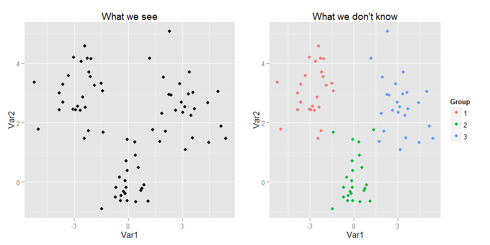
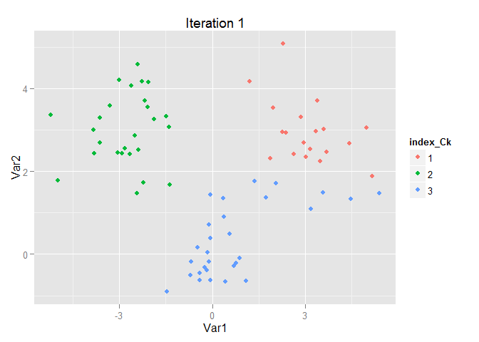
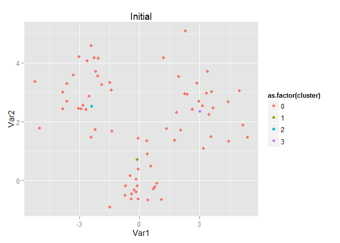
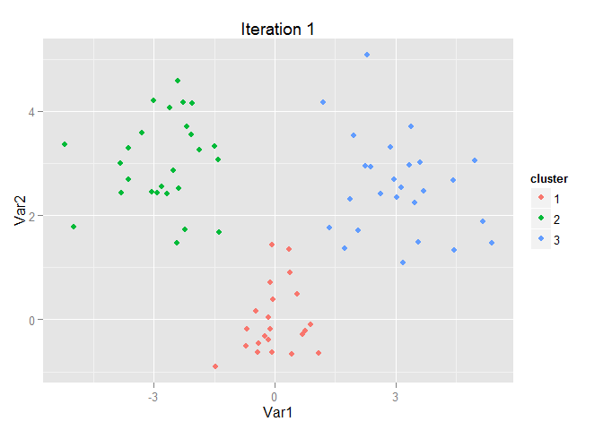
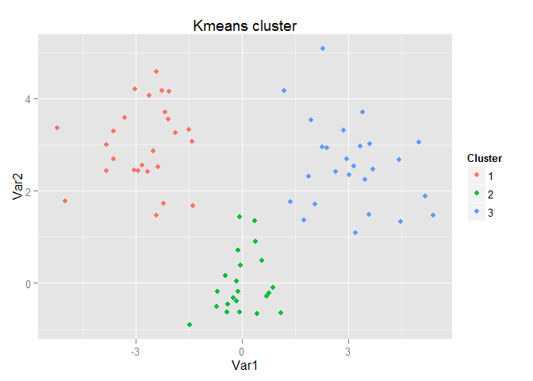
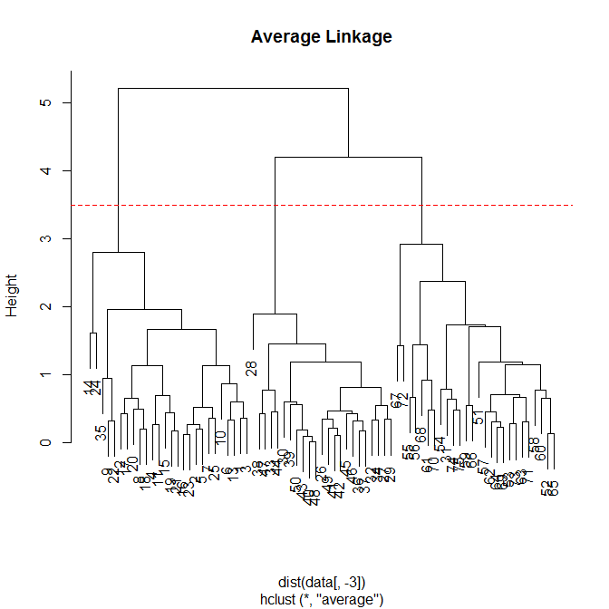
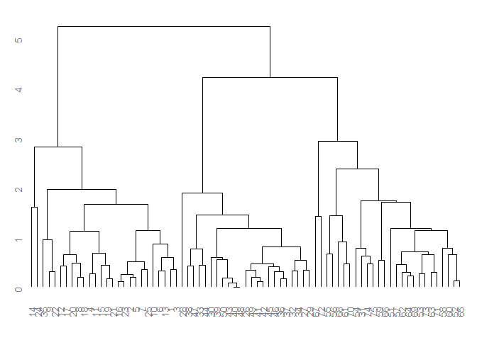
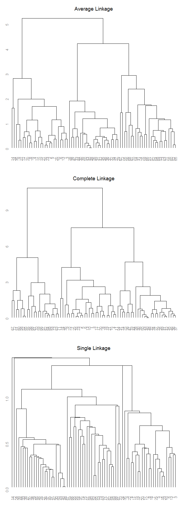
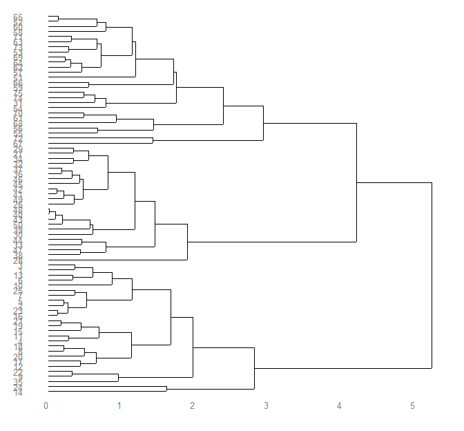

# Clustering Analysis
Jason  
2015年7月7日  


```r
library(ggplot2); library(dplyr); library(gridExtra); library(ggdendro)
```

# K-means


```r
set.seed(1)
Var1 <- c(rnorm(25, mean=-3), rnorm(25), rnorm(25, mean=3))
Var2 <- c(rnorm(25, mean=3), rnorm(25), rnorm(25, mean=3))
Group <- gl(3, 25)
m <- data.frame(Var1, Var2, Group)

#plot
g1 <- ggplot(m) + geom_point(aes(x=Var1, y=Var2)) +
  labs(title="What we see")
g2 <- ggplot(m) + geom_point(aes(x=Var1, y=Var2, color=Group)) +
  labs(title="What we don't know")
#Funcation in gridExtra
grid.arrange(g1, g2, ncol=2)
```


Step1. Initialize the cluster

```r
#Split the data
data <- data.frame(m[, 1:2], index_Ck=as.factor(sample(1:3, size=75, replace=T)))
```
Step2a. Calculate the cluster mean

```r
mean_Ck <- data %>%
            group_by(index_Ck) %>%
            summarise(Var1=mean(Var1), Var2=mean(Var2)) %>%
            select(Var1, Var2)
mean_Ck
```

```
Source: local data frame [3 x 2]

          Var1     Var2
1  0.189652066 2.071638
2 -0.009042401 2.137982
3  0.178629951 1.595406
```
Step2b. Rearrange the group

```r
distance <- function(x, group){
  sum((x - mean_Ck[group, ])^2)
}

distance_matrix <- cbind(apply(data[, 1:2], 1, distance, group=1), 
                         apply(data[, 1:2], 1, distance, group=2),
                         apply(data[, 1:2], 1, distance, group=3))
data$index_Ck <- as.factor(apply(distance_matrix, 1, which.min))
```


```r
ggplot(data) + geom_point(aes(x=Var1, y=Var2, color=index_Ck)) +
  labs(title="Iteration 1")
```




```r
#Within Cluster Variation
tapply(apply(distance_matrix, 1, min), data$index_Ck, sum)
```

```
       1        2        3 
204.3643 261.1209 153.0265 
```
Another way for kmeans

```r
data <- data.frame(m[, 1:2], cluster=rep(0))
initial <- sample(dim(data)[1], 3)
#set cluster
data[initial, 3] <- 1:3
#intial mean
mu <- data[initial, -3]

ggplot(data) + geom_point(aes(x=Var1, y=Var2, color=as.factor(cluster))) + labs(title="Initial")
```




```r
#Calculate the distance matrix
distance_matrix <- matrix(0, nrow=75, ncol=3)
for(i in 1:75){
  for(j in 1:3){
    distance_matrix[i, j] <- sum((data[i, -3] - mu[j, ])^2)
  }
}
#Find the cluster and update the cluster
data$cluster <- as.factor(apply(distance_matrix, 1, which.min))
```


```r
ggplot(data) + geom_point(aes(x=Var1, y=Var2, color=cluster)) +
  labs(title="Iteration 1")
```




```r
#Within Cluster Variation
tapply(apply(distance_matrix, 1, min), data$cluster, sum)
```

```
       1        2        3 
30.72541 52.39663 56.00541 
```

# kmeans

```r
km <- kmeans(data, centers=3)
```


```r
m_km <- data.frame(m, Cluster=as.factor(km$cluster))

g3 <- ggplot(m_km) + geom_point(aes(x=Var1, y=Var2, color=Cluster)) +
  labs(title="Kmeans cluster")
g3
```




```r
km$withinss
```

```
[1] 42.11065 17.24915 54.73124
```

# Hierarchical Clustering

```r
data <- m[, 1:2]
```


```r
hc.avg <- hclust(dist(data[, -3]), method="average")
hc.com <- hclust(dist(data[, -3]), method="complete")
hc.sin <- hclust(dist(data[, -3]), method="single")
```


```r
plot(hc.avg, main="Average Linkage")
abline(h=3.5, lty=2, col="red")
```




```r
cutree(hc.avg, 3.5)
```

```
 [1] 1 1 1 1 1 1 1 1 1 1 1 1 1 1 1 1 1 1 1 1 1 1 1 1 1 2 2 2 2 2 3 2 2 2 1
[36] 2 2 2 2 2 2 2 2 2 2 2 2 2 2 2 3 3 3 3 3 3 3 3 3 3 3 3 3 3 3 3 3 3 3 3
[71] 3 3 3 3 3
```


```r
#ggdendro
ggdendrogram(hc.avg)
```




```r
gg1 <- ggdendrogram(hc.avg) + labs(title="Average Linkage")
gg2 <- ggdendrogram(hc.com) + labs(title="Complete Linkage")
gg3 <- ggdendrogram(hc.sin) + labs(title="Single Linkage")
grid.arrange(gg1, gg2, gg3, ncol=1)
```




```r
ggdendrogram(hc.avg, rotate=TRUE)
```




# Reference

* [Using the ggdendro package for plotting dendrograms](http://cran.r-project.org/web/packages/ggdendro/vignettes/ggdendro.html)
