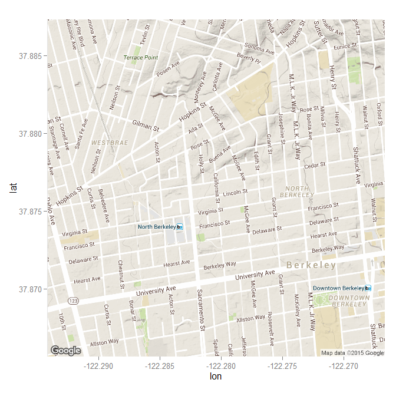

# ggmap
Chih Hui(Jason) Wang  
December 9, 2015  


```r
library(ggmap)
library(ggplot2)
library(gridExtra)
```

# qmap(like the qplot in ggplot2)


```r
berkeley <- "University of California, Berkeley"
qmap(berkeley, zoom=15)
```




```r
NCCU <- "National Chengchi University"
qmap(NCCU, zoom=17)
```


### Different Sources    
The function provides argument for user to decide which sources they want to use, including Google Maps, OpenStreetMap, StamenMaps, and CloudMade Maps(need API). 

```r
map_google <- qmap(NCCU, zoom=17)
map_OpenStreetMap <- qmap(NCCU, zoom=17, source="osm")
grid.arrange(map_google, map_OpenStreetMap, ncol=2)
```


You can also utilize the maker in google map too.

```r
location <- data.frame(x=c(121.574, 121.5765), y=c(24.985, 24.9867))

mymap <- get_googlemap(NCCU, marker=location, path=location, zoom=17, scale=2)
ggmap(mymap, extent="device")
```


### Different maptype    

For different sources, you will have different maytype you can choose.

* Google Map


```r
google_terrian <- qmap(NCCU, zoom=17)
google_satellite <- qmap(NCCU, zoom=17, maptype="satellite")
google_roadmap <- qmap(NCCU, zoom=17, maptype="roadmap")
google_hybrid <- qmap(NCCU, zoom=17, maptype="hybrid")

grid.arrange(google_terrian + ggtitle(label="Terrain"),
             google_satellite + ggtitle(label="Satellite"),
             google_roadmap + ggtitle(label="Roadmap"),
             google_hybrid + ggtitle(label="hybrid"),
             ncol=2)
```


* StamenMaps


```r
stamen_toner <- qmap(NCCU, zoom=17, maptype="toner", source="stamen")
stamen_water <- qmap(NCCU, zoom=17, maptype="watercolor", source="stamen")
stamen_tonerlite <- qmap(NCCU, zoom=17, maptype="toner-lite", source="stamen")
grid.arrange(stamen_toner,
             stamen_water,
             stamen_tonerlite,
             ncol=3)
```


# ggmap(like the ggplot in ggplot2)

As we saw above, the `qmap` is actually combine two-steps. First, we have to download the data. Second, we use `ggmap` to plot the data, which it uses the function in ggplot2 to make the plot.    
According to the introduction(see Reference), it will make the plot by


```r
ggplot(aes(x = lon, y = lat), data = fourCorners) +
  geom_blank() + coord_map("mercator") +
  annotation_raster(ggmap, xmin, xmax, ymin, ymax)
```

where fourCorners is the data frame with applying `expand.grid` on the longitude and latitude ranges.


```r
args(ggmap)
```

```
function (ggmap, extent = "panel", base_layer, maprange = FALSE, 
    legend = "right", padding = 0.02, darken = c(0, "black"), 
    ...) 
NULL
```

### 1. get_map with keyword search + ggmap (ggmap with Difference extent)

```r
Taipei101 <- get_map("Taipei 101", zoom=17)

#Default
ggmap(Taipei101, extent="panel") + ggtitle("Panel")
```


```r
#Without x, y label
ggmap(Taipei101, extent="device") + ggtitle("Device")
```


```r
#Like ggplot gray theme
ggmap(Taipei101, extent="normal") + ggtitle("Normal")
```


### 2. Geocoding + ggmap

You can use the `geocode` command to retrieve the geocoding of a specific address, building... If you provide more information about the place, it will increase the precision. Then use the `ggmap` to make the map.

```r
geocode("Berkeley", source="google")
```

```
        lon      lat
1 -122.2727 37.87159
```

```r
geocode("Evans Hall, Berkeley, CA", source="google")
```

```
        lon      lat
1 -122.2578 37.87365
```

```r
#Default
geocode("Evans Hall, Berkeley, CA", source="google", output="latlon")
```

```
        lon      lat
1 -122.2578 37.87365
```

```r
#With address
geocode("Evans Hall, Berkeley, CA", source="google", output="latlona")
```

```
        lon      lat                             address
1 -122.2578 37.87365 evans hall, berkeley, ca 94720, usa
```

You can grab all the information from Google map by its API. You can go to the [Google geocoding API](https://developers.google.com/maps/documentation/geocoding/intro). It will explain all the information outputted by the `geocode` with argument `output="all"`.


```r
#Check Google API
geocode("Evans Hall, Berkeley, CA", source="google", output="all")
```

You can only grab 2500 data per day, so you may want to use the `geocodeQueryCheck()` to see how many query you still can use.


```r
#Check how many quota you have
geocodeQueryCheck()
```

```
2500 geocoding queries remaining.
```

You can check the loctype to see the precision of the result. It divides into `rooftop` and `approximate`.


```r
geo1 <- geocode("Evans Hall, Berkeley, CA", source="google", output="more")
geo1$loctype
```

```
[1] rooftop
Levels: rooftop
```

```r
geo2 <- geocode("Sather Gate, Berkeley, CA", source="google", output="more")
geo2$loctype
```

```
[1] approximate
Levels: approximate
```

Once you have the geocoding, you can throw the output into `ggmap` to produce the desired map.


```r
df <- rbind(geo1[c("lon", "lat")], geo2[c("lon", "lat")])

map <- get_map(c(mean(df$lon), mean(df$lat)), zoom=17)
ggmap(map) + geom_point(data=df, aes(x=lon, y=lat), color="red", size=5)
```


Now, we have the map framework. If you have some data with geo-information and you want to visualize the data, you can take the map from `ggmap` as the background and use the function in `ggplot2` to add the informatino you have on the map!

### Reference
* [D. Kahle and H. Wickham. ggmap: Spatial Visualization with ggplot2. The R Journal, 5(1), 144-161.](http://journal.r-project.org/archive/2013-1/kahle-wickham.pdf)
