# ggplot2
Jason  
Monday, May 25, 2015  


http://zevross.com/blog/2014/08/04/beautiful-plotting-in-r-a-ggplot2-cheatsheet-3/
For `ggplot`, `gg` is `Grammar of Graphics`. Think Verb, Noun, adjective for graphics. Plots are made up of *aesthetics* (size, shap, color) and *geoms* (points, lines) 


```r
library(ggplot2)

#Demo data
data(mtcars)
str(mtcars)
```

```
'data.frame':	32 obs. of  11 variables:
 $ mpg : num  21 21 22.8 21.4 18.7 18.1 14.3 24.4 22.8 19.2 ...
 $ cyl : num  6 6 4 6 8 6 8 4 4 6 ...
 $ disp: num  160 160 108 258 360 ...
 $ hp  : num  110 110 93 110 175 105 245 62 95 123 ...
 $ drat: num  3.9 3.9 3.85 3.08 3.15 2.76 3.21 3.69 3.92 3.92 ...
 $ wt  : num  2.62 2.88 2.32 3.21 3.44 ...
 $ qsec: num  16.5 17 18.6 19.4 17 ...
 $ vs  : num  0 0 1 1 0 1 0 1 1 1 ...
 $ am  : num  1 1 1 0 0 0 0 0 0 0 ...
 $ gear: num  4 4 4 3 3 3 3 4 4 4 ...
 $ carb: num  4 4 1 1 2 1 4 2 2 4 ...
```

\newpage

#1. Basic function qplot

```r
#Fundamental
qplot(hp, mpg, data=mtcars)
```


```r
#Add color
#Type 1
qplot(hp, mpg, data=mtcars, color=am)
```

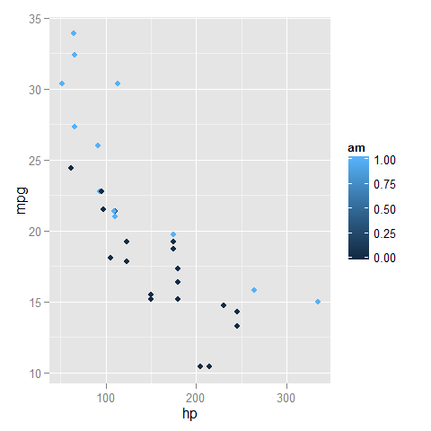


```r
#Type 2
qplot(hp, mpg, data=mtcars, color=as.factor(am))
```

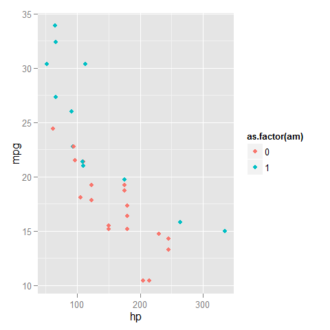


```r
#Change shape
qplot(hp, mpg, data=mtcars, shape=as.factor(am))
```

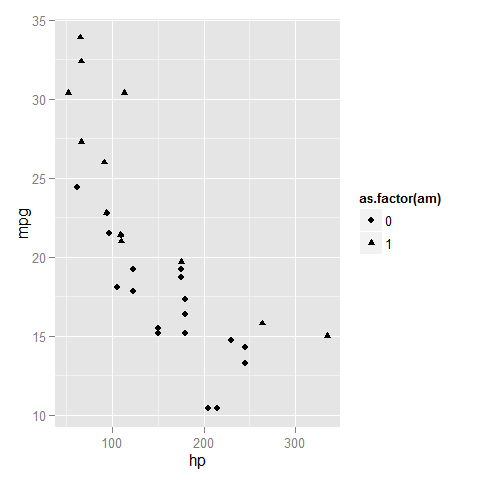


```r
#Add geoms
qplot(hp, mpg, data=mtcars, geom=c("point", "smooth"), method="lm")
```

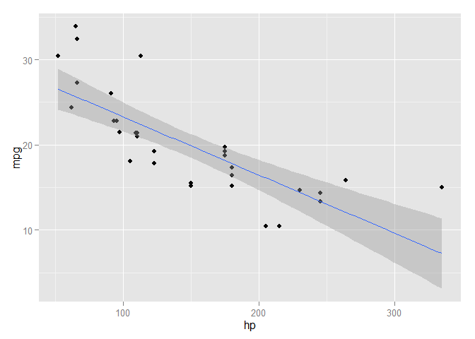


```r
#Histogram
qplot(mpg, data=mtcars, fill=as.factor(am), binwidth=2)
```

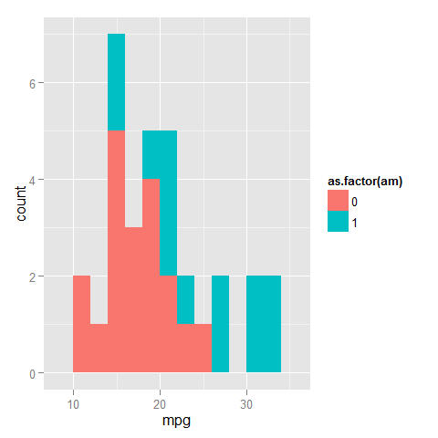


```r
#Facets
qplot(hp, mpg, data=mtcars, facets=. ~ am)
```

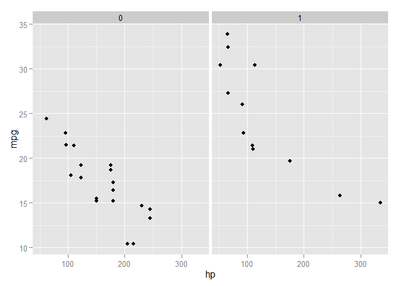


```r
#Facets
qplot(mpg, data=mtcars, facets=am ~ ., binwidth=2)
```

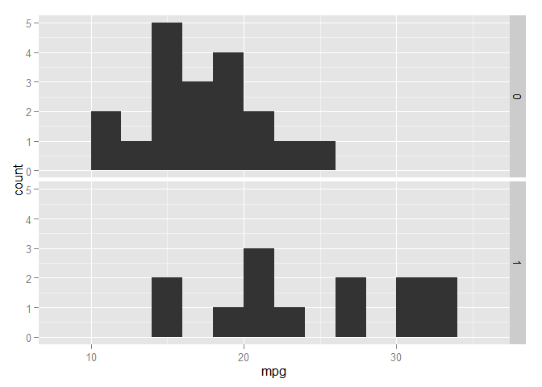


```r
#Density Smooth
qplot(mpg, data=mtcars, geom="density")
```

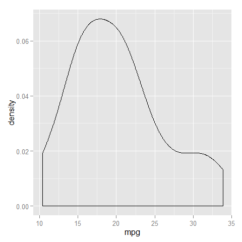

```r
qplot(mpg, data=mtcars, geom="density", color=as.factor(am))
```

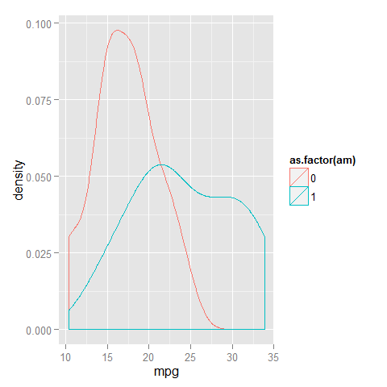

The qplot is quite similar to the plot in base R. In the following, we will introduce the ggplot function to make a more well-structrue and beautiful plot.

```r
library(dplyr)

mtcars <- mtcars %>%
            mutate(cyl=as.factor(cyl)) %>%
            mutate(vs=as.factor(vs)) %>%
            mutate(am=as.factor(am))
str(mtcars)
```

```
'data.frame':	32 obs. of  11 variables:
 $ mpg : num  21 21 22.8 21.4 18.7 18.1 14.3 24.4 22.8 19.2 ...
 $ cyl : Factor w/ 3 levels "4","6","8": 2 2 1 2 3 2 3 1 1 2 ...
 $ disp: num  160 160 108 258 360 ...
 $ hp  : num  110 110 93 110 175 105 245 62 95 123 ...
 $ drat: num  3.9 3.9 3.85 3.08 3.15 2.76 3.21 3.69 3.92 3.92 ...
 $ wt  : num  2.62 2.88 2.32 3.21 3.44 ...
 $ qsec: num  16.5 17 18.6 19.4 17 ...
 $ vs  : Factor w/ 2 levels "0","1": 1 1 2 2 1 2 1 2 2 2 ...
 $ am  : Factor w/ 2 levels "0","1": 2 2 2 1 1 1 1 1 1 1 ...
 $ gear: num  4 4 4 3 3 3 3 4 4 4 ...
 $ carb: num  4 4 1 1 2 1 4 2 2 4 ...
```

# Scatter plot

```r
ggplot(mtcars) + geom_point(aes(x=hp, y=mpg))
```

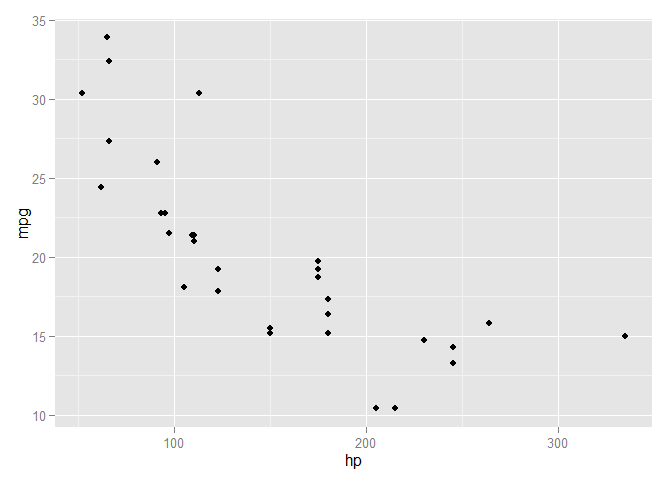


```r
#Color by am
ggplot(mtcars) + geom_point(aes(x=hp, y=mpg, color=am))
```

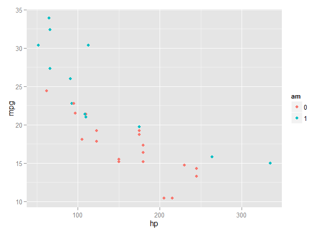 


```r
#Color by am and add trend line
ggplot(mtcars) + geom_point(aes(x=hp, y=mpg, color=am)) +
  geom_smooth(aes(x=hp, y=mpg, color=am), method="lm")
```

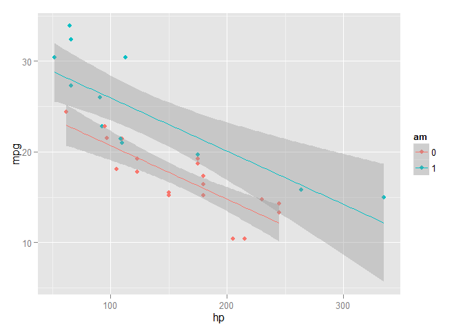 


```r
#Divide into two facet
ggplot(mtcars) + geom_point(aes(x=hp, y=mpg, color=am)) +
  facet_grid(. ~ am) + geom_smooth(aes(x=hp, y=mpg, color=am), method="lm")
```

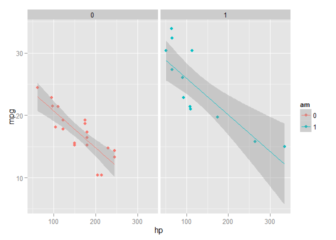 

# Histogram

```r
ggplot(mtcars) + geom_histogram(aes(x=hp), binwidth=5)
```

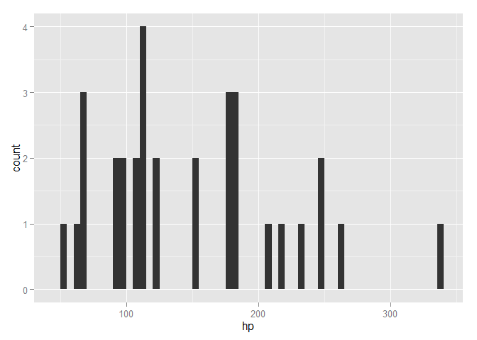 


```r
ggplot(mtcars) + geom_histogram(aes(x=hp, fill=am), binwidth=5, position="dodge")
```

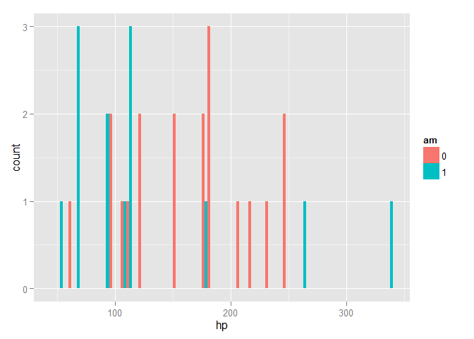 


```r
#Divide into two part
ggplot(mtcars) + geom_histogram(aes(x=hp, y=..density.., fill=am), binwidth=5, position="dodge") +
  facet_grid(am ~ .)
```

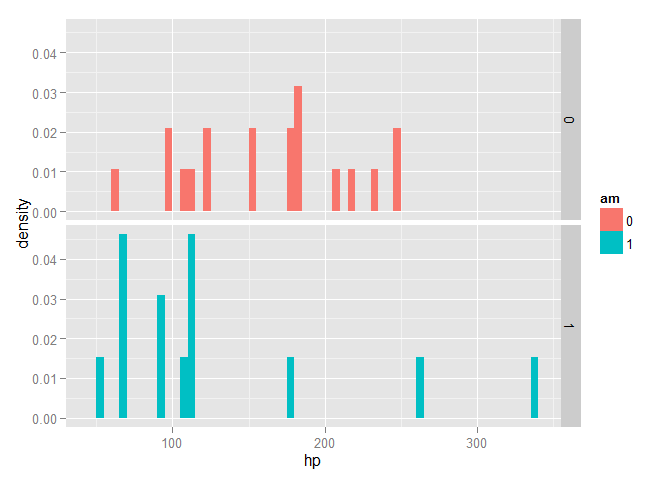 
# Density plot

```r
ggplot(mtcars) + geom_density(aes(x=hp, fill=am)) +
  facet_grid(am ~ .)
```

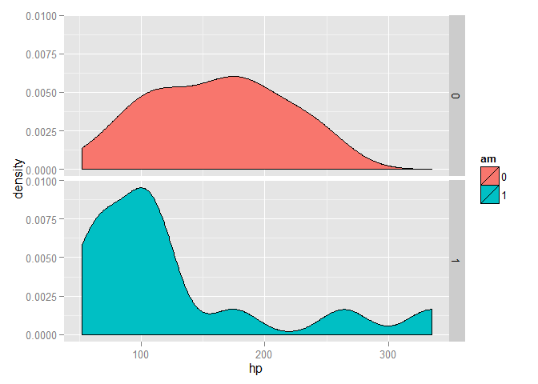 
# Density + histogram

```r
ggplot(mtcars) + geom_histogram(aes(x=hp, y=..density.., fill=am), binwidth=5) + 
  geom_density(aes(x=hp, color=am)) +
  facet_grid(am ~ .)
```

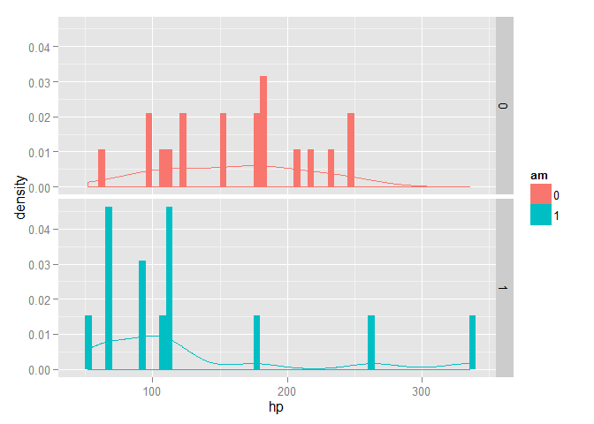 

** Reference **

1. [ggplot themes](http://docs.ggplot2.org/0.9.2.1/theme.html)

2. [basic Intro to qplot](http://www.r-bloggers.com/basic-introduction-to-ggplot2/)

3. [Cheatsheet for Visualizing Distributions](http://www.r-bloggers.com/ggplot2-cheatsheet-for-visualizing-distributions/)
