# ggplot2 by Hadley Wickham (book example)
Chih Hui Wang  
September 29, 2015  


```r
library(ggplot2); library(gridExtra); library(grid)
```


```r
#Data in nlme pacakge
Oxboys <- nlme::Oxboys

#Summay of data
summary(Oxboys)
```

```
    Subject         age               height         Occasion 
 10     :  9   Min.   :-1.00000   Min.   :126.2   1      :26  
 26     :  9   1st Qu.:-0.46300   1st Qu.:143.8   2      :26  
 25     :  9   Median :-0.00270   Median :149.5   3      :26  
 9      :  9   Mean   : 0.02263   Mean   :149.5   4      :26  
 2      :  9   3rd Qu.: 0.55620   3rd Qu.:155.5   5      :26  
 6      :  9   Max.   : 1.00550   Max.   :174.8   6      :26  
 (Other):180                                      (Other):78  
```
* Subject: 26 boys
* age: Centered age
* Hegiht
* Occassion: measure in 9 occasions


```r
#Plot by group (Subject)
p <- ggplot(Oxboys, aes(x=age, y=height, group=Subject)) + geom_line() 

#Smooth overall
p2 <- p + geom_smooth(aes(group=1), method="lm", se=FALSE, size=2)

grid.arrange(p, p2, ncol=2)
```


```r
#Boxplot for each ocassion
boysbox <- ggplot(Oxboys, aes(x=Occasion, y=height)) + geom_boxplot()

#Boxplot with line for each subject
boysbox_line <- boysbox + geom_line(aes(group=Subject), colour="#3366FF")

grid.arrange(boysbox, boysbox_line, ncol=2)
```


```r
#Data in ggplot2 package
data(diamonds)

summary(diamonds)
```

```
     carat               cut        color        clarity     
 Min.   :0.2000   Fair     : 1610   D: 6775   SI1    :13065  
 1st Qu.:0.4000   Good     : 4906   E: 9797   VS2    :12258  
 Median :0.7000   Very Good:12082   F: 9542   SI2    : 9194  
 Mean   :0.7979   Premium  :13791   G:11292   VS1    : 8171  
 3rd Qu.:1.0400   Ideal    :21551   H: 8304   VVS2   : 5066  
 Max.   :5.0100                     I: 5422   VVS1   : 3655  
                                    J: 2808   (Other): 2531  
     depth           table           price             x         
 Min.   :43.00   Min.   :43.00   Min.   :  326   Min.   : 0.000  
 1st Qu.:61.00   1st Qu.:56.00   1st Qu.:  950   1st Qu.: 4.710  
 Median :61.80   Median :57.00   Median : 2401   Median : 5.700  
 Mean   :61.75   Mean   :57.46   Mean   : 3933   Mean   : 5.731  
 3rd Qu.:62.50   3rd Qu.:59.00   3rd Qu.: 5324   3rd Qu.: 6.540  
 Max.   :79.00   Max.   :95.00   Max.   :18823   Max.   :10.740  
                                                                 
       y                z         
 Min.   : 0.000   Min.   : 0.000  
 1st Qu.: 4.720   1st Qu.: 2.910  
 Median : 5.710   Median : 3.530  
 Mean   : 5.735   Mean   : 3.539  
 3rd Qu.: 6.540   3rd Qu.: 4.040  
 Max.   :58.900   Max.   :31.800  
                                  
```


```r
d <- ggplot(diamonds, aes(x=carat)) + xlim(0, 3)

#Area + count
d1 <- d + stat_bin(aes(ymax=..count..), binwidth=0.1, geom="area")

#Point + density
d2 <- d + stat_bin(
  aes(size=..density..), binwidth=0.1,
  geom="point", position="identity"
)

grid.arrange(d1, d2, ncol=2)
```

```
Warning: Removed 2 rows containing missing values (geom_point).
```

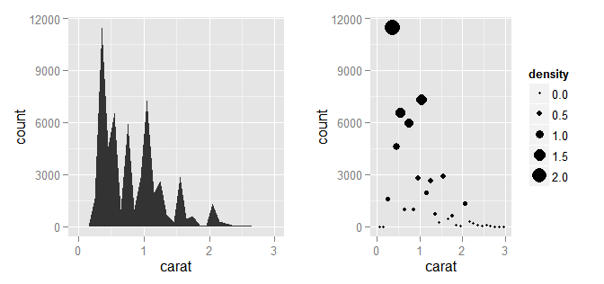

# Different geom summary


```r
mydata <- data.frame(x=c(3, 1, 5), y=c(2, 4, 6),
                      label=c("a", "b", "c"))
g <- ggplot(mydata, aes(x=x, y=y, label=label)) + xlab(NULL) + ylab(NULL)

grid.arrange(
  g + geom_point() + ggtitle("Point"),
  g + geom_bar(stat="Identity") + ggtitle("Bar"),
  g + geom_line() + ggtitle("Line"),
  g + geom_path() + ggtitle("Path"),
  g + geom_area() + ggtitle("Area"),
  g + geom_text() + ggtitle("Text"),
  g + geom_tile() + ggtitle("Tile"),
  g + geom_polygon() + ggtitle("Polygon"),
  ncol=4
)
```

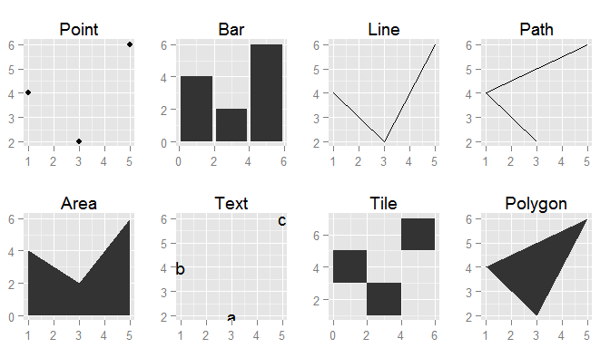
* Density

```r
depth_dist <- ggplot(diamonds, aes(depth))
grid.arrange(
  depth_dist + geom_histogram(),
  depth_dist + geom_histogram(aes(y=..density..), binwidth=0.1) + xlim(55, 70),
  ncol=2
)
```

```
stat_bin: binwidth defaulted to range/30. Use 'binwidth = x' to adjust this.
```

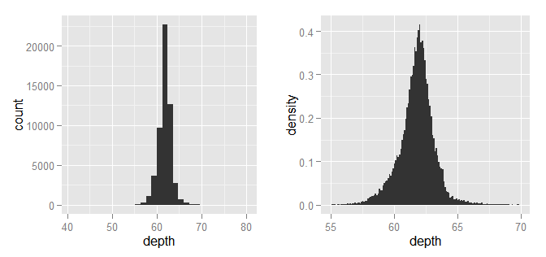

* Conditional density


```r
grid.arrange(
  depth_dist + geom_histogram(aes(y=..density..), binwidth=0.1) + facet_grid(cut ~ .) + xlim(55, 70),
  depth_dist + geom_freqpoly(aes(y=..density.., color=cut), binwidth=0.1) + xlim(55, 75),
  ggplot(diamonds, aes(x=cut, y=depth)) + geom_boxplot(),
  ncol=1
)
```

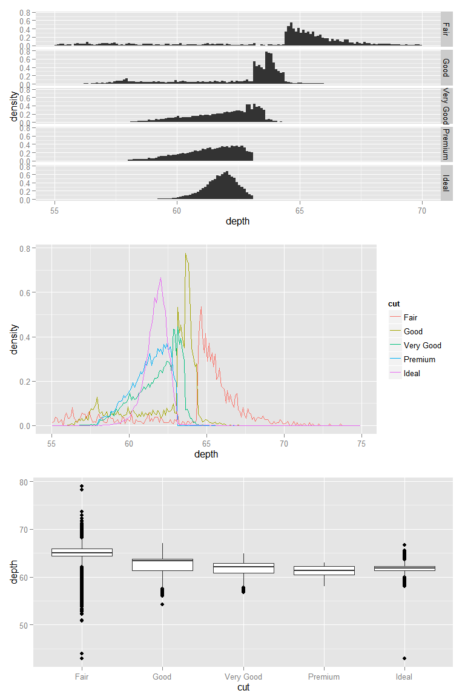

* 2D density


```r
norm <- data.frame(x=rnorm(10000), y=rnorm(10000))

g <- ggplot(norm, aes(x=x, y=y))
grid.arrange(
  g + geom_point(),
  g + geom_point(shape="."),
  g + geom_point(alpha=1/3),
  g + geom_point(alpha=1/5),
  ncol=2
)
```

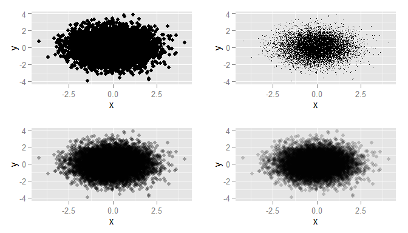

# Maps


```r
library(maps)
ggplot() + borders("world", size=0.5)
```

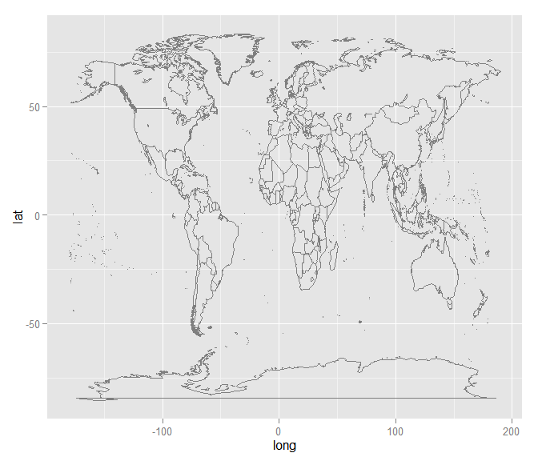


```r
data("us.cities")
#Pull out capital for each state
library(dplyr)
capital <- us.cities %>%
            filter(capital == 2)

ggplot(capital, aes(x=long, y=lat)) + geom_point() + borders("state", size=0.5)
```

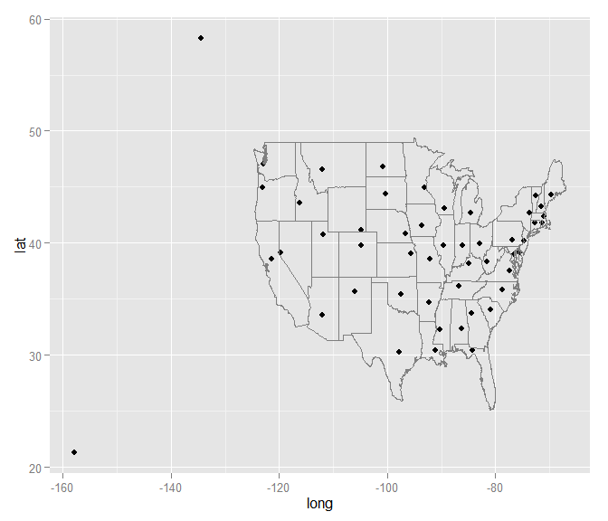


```r
#Map data(states)
states <- map_data("state")
#crime summary for us cities
arrest <- USArrests

#Change the name into lower case
names(arrest) <- tolower(names(arrest))
#Add a column for merge later
arrest$region <- tolower(rownames(arrest))

#Combine by region
choro <- merge(states, arrest, by = "region")

# Reorder the rows because order matters when drawing polygons
# and merge destroys the original ordering
choro <- choro[order(choro$order), ]

grid.arrange(
  ggplot(choro, aes(x=long, y=lat, group=group, fill=murder)) + geom_polygon(),
  ggplot(choro, aes(x=long, y=lat, group=group, fill=assault)) + geom_polygon(),
  ggplot(choro, aes(x=long, y=lat, group=group, fill=urbanpop)) + geom_polygon(),
  ggplot(choro, aes(x=long, y=lat, group=group, fill=rape)) + geom_polygon(),
  ncol=2
)
```

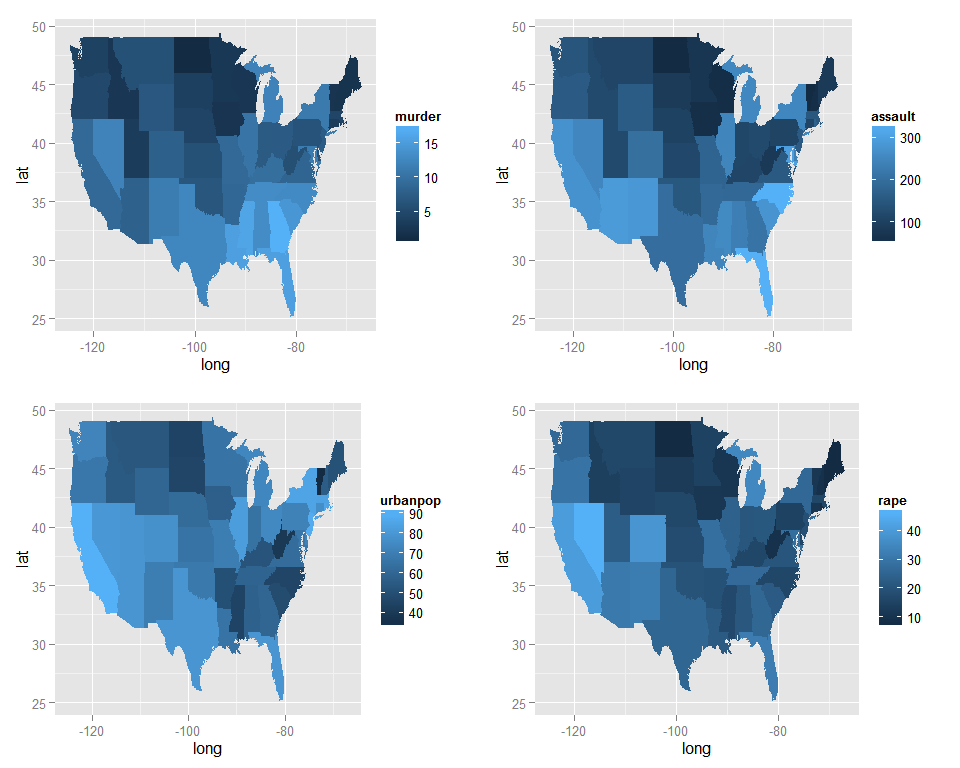

# Annotation


```r
head(economics)
```

```
        date   pce    pop psavert uempmed unemploy
1 1967-06-30 507.8 198712     9.8     4.5     2944
2 1967-07-31 510.9 198911     9.8     4.7     2945
3 1967-08-31 516.7 199113     9.0     4.6     2958
4 1967-09-30 513.3 199311     9.8     4.9     3143
5 1967-10-31 518.5 199498     9.7     4.7     3066
6 1967-11-30 526.2 199657     9.4     4.8     3018
```


```r
head(presidential)
```

```
        name      start        end      party
1 Eisenhower 1953-01-20 1961-01-20 Republican
2    Kennedy 1961-01-20 1963-11-22 Democratic
3     Johson 1963-11-22 1969-01-20 Democratic
4      Nixon 1969-01-20 1974-08-09 Republican
5       Ford 1974-08-09 1977-01-20 Republican
6     Carter 1977-01-20 1981-01-20 Democratic
```


```r
uemp <- ggplot(economics, aes(x=date, y=unemploy)) + xlab("Year") + ylab("No. of unemploy")

uemp + geom_line()
```

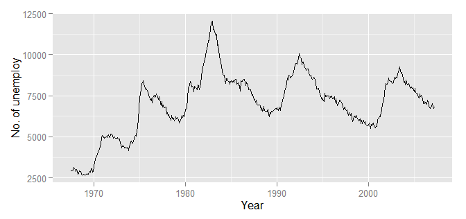


```r
yrng <- range(economics$unemploy)
#Add different president period
uemp + geom_line() + geom_rect(aes(NULL, NULL, xmin=start, xmax=end, fill=party), ymin=yrng[1], ymax=yrng[2], data=presidential, alpha=0.2) + scale_fill_manual(values=c("blue", "red"))
```


### legend and color

```r
head(msleep)
```

```
                        name      genus  vore        order conservation
1                    Cheetah   Acinonyx carni    Carnivora           lc
2                 Owl monkey      Aotus  omni     Primates         <NA>
3            Mountain beaver Aplodontia herbi     Rodentia           nt
4 Greater short-tailed shrew    Blarina  omni Soricomorpha           lc
5                        Cow        Bos herbi Artiodactyla domesticated
6           Three-toed sloth   Bradypus herbi       Pilosa         <NA>
  sleep_total sleep_rem sleep_cycle awake brainwt  bodywt
1        12.1        NA          NA  11.9      NA  50.000
2        17.0       1.8          NA   7.0 0.01550   0.480
3        14.4       2.4          NA   9.6      NA   1.350
4        14.9       2.3   0.1333333   9.1 0.00029   0.019
5         4.0       0.7   0.6666667  20.0 0.42300 600.000
6        14.4       2.2   0.7666667   9.6      NA   3.850
```


```r
g <- ggplot(msleep, aes(x=sleep_total, y=sleep_cycle, color=vore)) + geom_point()
grid.arrange(
  #Default
  g,
  
  #Change legend and label name
  g + scale_color_hue("What does it eat?",
                      breaks=c("carni", "herbi", "omni", "insecti"),
                      labels=c("meat", "plant", "both", "No idea")),
  
  #Change palette
  g + scale_color_brewer(palette = "Set1"),
  
  #change all manually
  g + scale_color_manual("What does it eat?", values=c("red", "forestgreen", "powderblue", "black"), breaks=c("carni", "herbi", "omni", "insecti"), labels=c("meat", "plant", "both", "No idea")),
  ncol=2
)
```

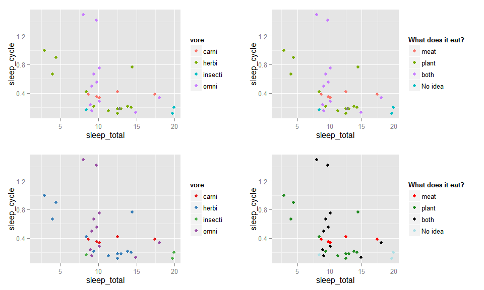

### name

```r
g <- ggplot(mpg, aes(x=cty, y=hwy, color=displ)) + geom_point()

grid.arrange(
  #Default
  g,
  
  #Change xlab and ylab name,
  g + xlab("City mpg") + ylab("Highway mpg"),
  
  #All in one command,
  g + labs(x="City mpg", y="Highway mpg", color="Displacement"),
  
  #Math notation, check ?plotmath
  g + xlab(expression(frac(mpg, gallon))),
  ncol=2
)
```

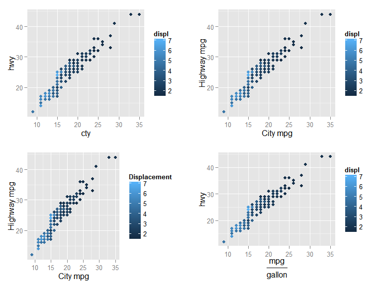

### breaks and limits

```r
g <- ggplot(mtcars, aes(x=cyl, y=wt)) + geom_point()
g2 <- ggplot(mtcars, aes(x=wt, y=cyl, color=cyl)) + geom_point()
  
grid.arrange(
  #Default
  g,
  
  #Change breaks
  g + scale_x_continuous(breaks=c(4, 4.5, 5, 5.5, 6, 6.5, 7, 7.5, 8)),
  
  #Change limits
  g + scale_x_continuous(limits=c(5.5, 6.5)),
  
  #Default
  g2,
  
  #break
  g2 + scale_color_gradient(breaks=c(5.5, 6.5)),
  #limit
  g2 + scale_color_gradient(limits=c(5.5, 6.5)),
  ncol=3
)
```

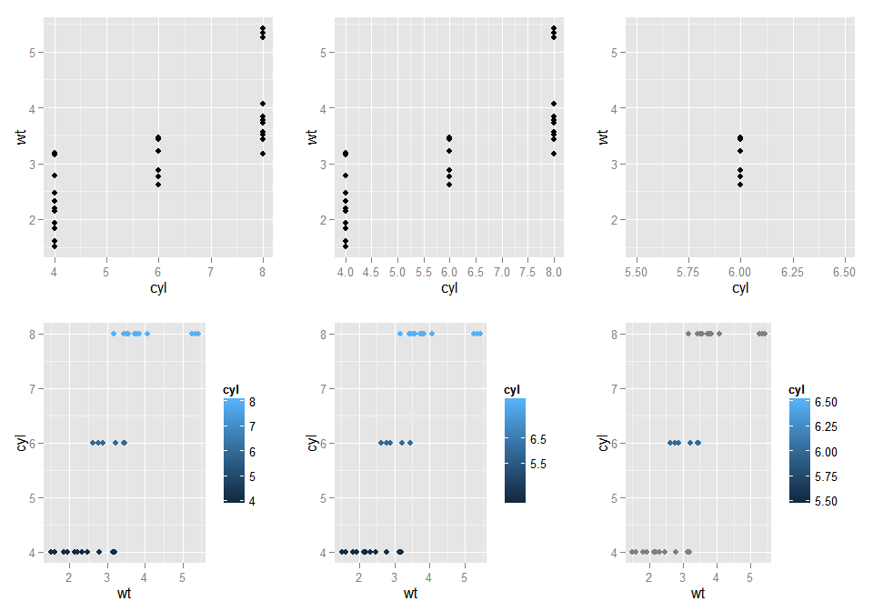
### scale

```r
#The axis use transformation in ggplot is the original scale, but the graph is log scale
grid.arrange(
  ggplot(diamonds, aes(x=carat, y=price)) + geom_point() + scale_x_continuous(trans="log10") + scale_y_continuous(trans="log10"),
  ggplot(diamonds, aes(x=log(carat), log(price))) + geom_point(),
  ncol=2
)
```

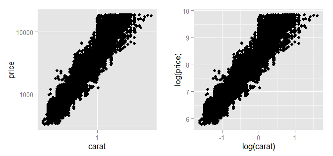


```r
# to access breaks/formatting functions
library(scales)
g <- ggplot(economics, aes(x=date, y=psavert)) + geom_line() + geom_hline(xintercept=0, color="grey50")

grid.arrange(
  g,
  g + scale_x_date(breaks=date_breaks("5 years")),
  g + scale_x_date(breaks=date_breaks("5 years"), labels=date_format("%Y")),
  nrow=3
)
```

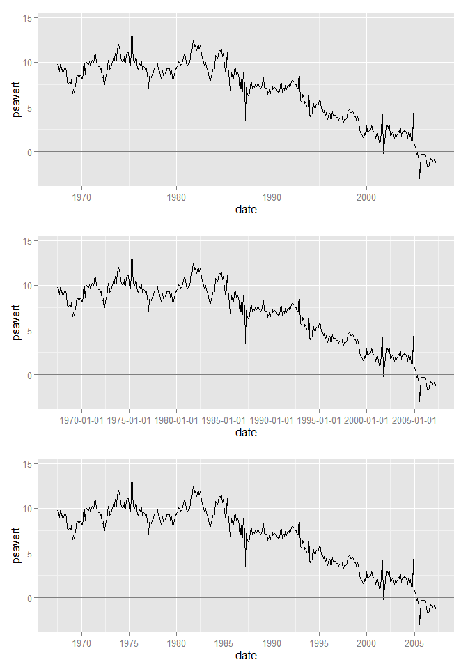

### data_format Code

Code | Meaning
------------- | -------------
%S | second (00-59)
%M | minute (00-59)
%l | hour, in 12-hour clock (1-12)
%I | hour, in 12-hour clock (01-12)
%H | hour, in 24-hour clock (00-23)
%a | day of the week, abbreviated (Mon-Sun)
%A | day of the week, full (Monday-Sunday)
%e | day of the month (1-31)
%d | day of the month (01-31)
%m | month, numeric (01-12)
%b | month, abbreviated (Jan-Dec)
%B | month, full (January-December)
%y | year, without century (00-99)
%Y | year, with century (0000-9999)


### Color

```r
f2d <- with(faithful, MASS::kde2d(eruptions, waiting,
                                  h = c(1, 10), n = 50))

df <- with(f2d, cbind(expand.grid(x, y), as.vector(z)))
names(df) <- c("eruptions", "waiting", "density")

#expand=c(0, 0) to remove the side space
g <- ggplot(df, aes(x=eruptions, y=waiting, fill=density)) + geom_tile() + scale_x_continuous(expand=c(0, 0)) + scale_y_continuous(expand=c(0, 0))

grid.arrange(
  g + scale_fill_gradient(limits=c(0, 0.04)),
  g + scale_fill_gradient(limits = c(0, 0.04),
low = "white", high = "black"),
  g + scale_fill_gradient2(limits = c(-0.04, 0.04),
midpoint = mean(df$density)),
  ncol=3
)
```

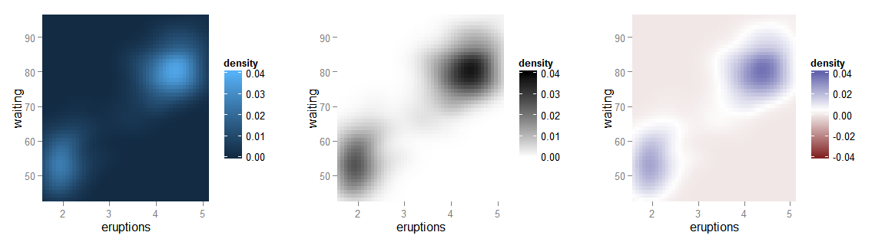


```r
g <- ggplot(msleep, aes(x=brainwt, y=bodywt, color=vore)) + geom_point() + scale_x_continuous(trans="log10") + scale_y_continuous(trans="log10")

color <- c(carni="red", herbi="green", omni="blue", insecti="orange", "NA"="black")

grid.arrange(
  g,
  g + scale_color_manual(values=color),
  ncol=2
)
```

```
Warning: Removed 27 rows containing missing values (geom_point).
```

```
Warning: Removed 27 rows containing missing values (geom_point).
```

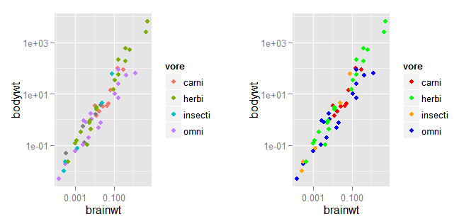

### Faceting

####1. Faect grid

* . ~ a: A single row with multiple columns.
* b ~ .: A single column with multiple rows.
* . ~ .: Default
* a ~ b: Multiple rows and columns.


```r
# . ~ a
ggplot(mtcars, aes(x=wt, y=mpg)) + geom_point() + facet_grid(. ~ am)
```

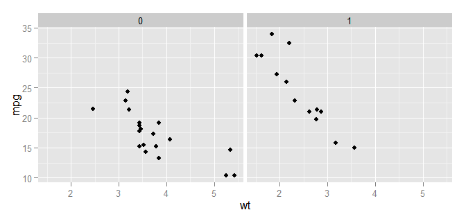


```r
# b ~ .
ggplot(mtcars, aes(x=mpg)) + geom_histogram(binwidth=1) + facet_grid(cyl ~ .)
```

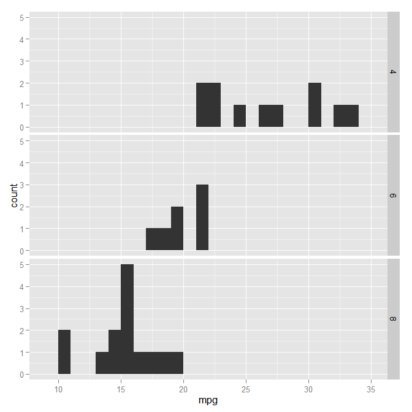


```r
# a ~ b
ggplot(mtcars, aes(x=wt, y=mpg)) + geom_point() + facet_grid(gear ~ am)
```

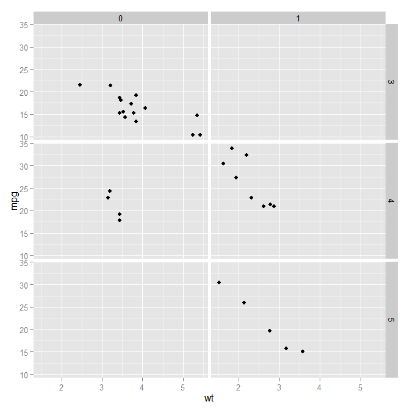

### Add margin & smooth line

```r
ggplot(mtcars, aes(x=wt, y=mpg)) + geom_point() + facet_grid(gear ~ am, margins=TRUE) + geom_smooth(aes(colour = gear), method = "lm", se = F)
```

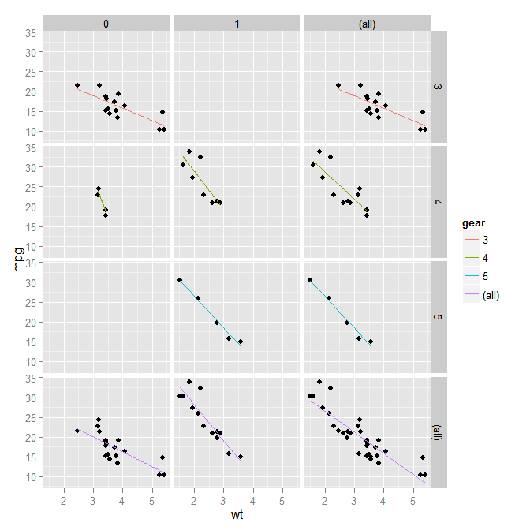

### space in facet grid


```r
ggplot(mpg, aes(x=cty, y=model)) + geom_point() + facet_grid(manufacturer ~ ., scale="free")
```

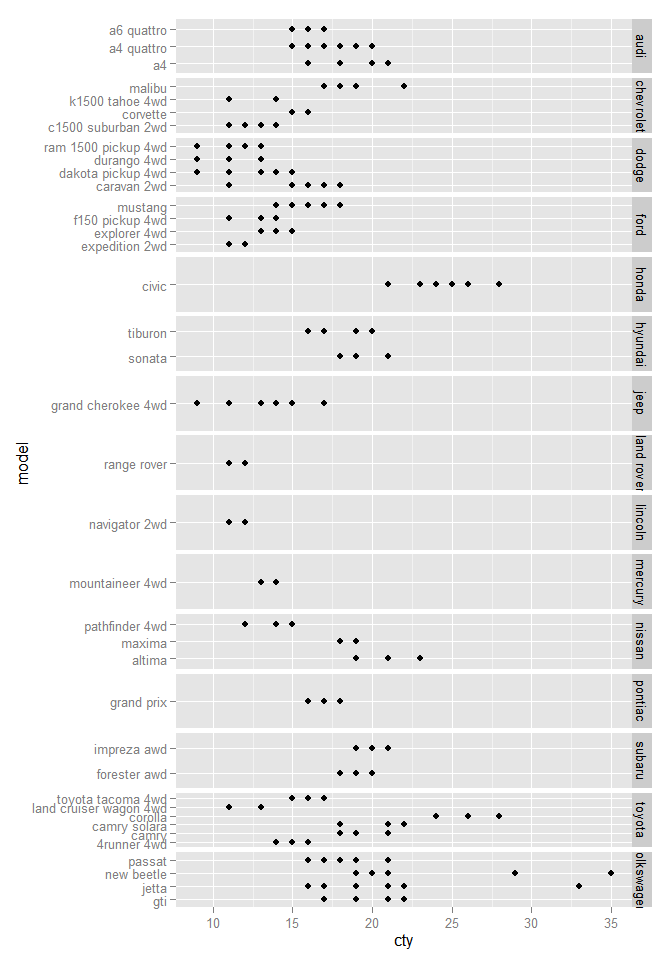

When the space can vary freely, each column (or
row) will have width (or height) proportional to the range of the scale for that
column (or row).

```r
#Space is free
ggplot(mpg, aes(x=cty, y=model)) + geom_point() + facet_grid(manufacturer ~ ., space="free", scale="free")
```

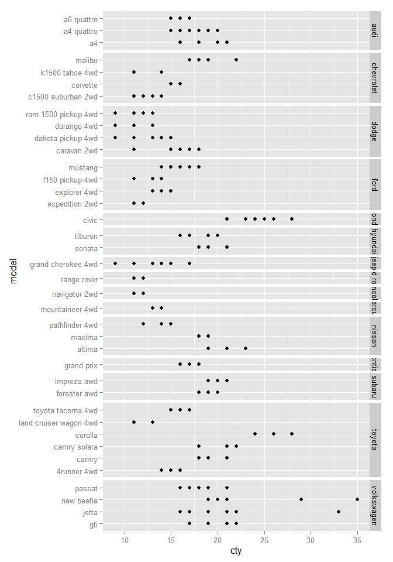


####2. Facet wrap

```r
economics$year <- substr(economics$date, 1, 4)
ggplot(economics, aes(x=unemploy, y=uempmed)) + geom_point() + facet_wrap(~ year, ncol=6)
```

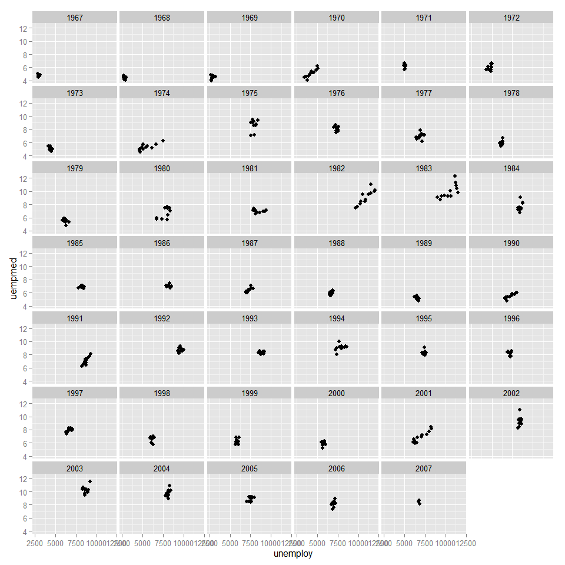

#### Both of grid and wrap can adjust the scale

* scales = "fixed": x and y scales are fixed across all panels.
* scales = "free": x and y scales vary across panels.
* scales = "free_x": the x scale is free, and the y scale is fixed.
* scales = "free_y": the y scale is free, and the x scale is fixed.


```r
ggplot(economics, aes(x=unemploy, y=uempmed)) + geom_point() + facet_wrap(~ year, ncol=6, scale="free")
```

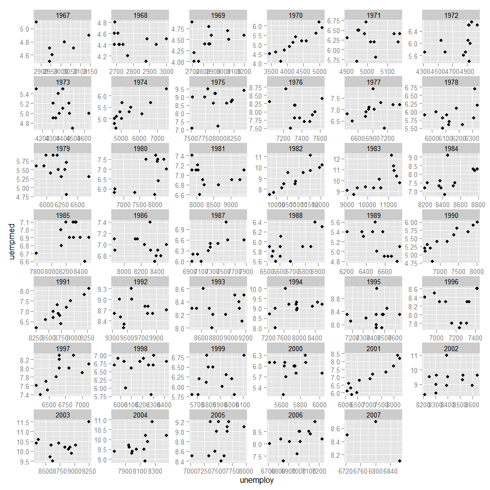

### Coordinate System

* A useful function: coord_flip(), which can flip the x, y axis.

#### limits for scale and coordinate system

```r
g <- ggplot(mtcars, aes(x=disp, y=wt)) + geom_point() + geom_smooth()

grid.arrange(
  g,
  #Eliminate points outside the limits
  g + scale_x_continuous(limits=c(300, 500)),
  #Display small region 
  g + coord_cartesian(xlim=c(300, 500)),
  ncol=3
)
```

```
geom_smooth: method="auto" and size of largest group is <1000, so using loess. Use 'method = x' to change the smoothing method.
geom_smooth: method="auto" and size of largest group is <1000, so using loess. Use 'method = x' to change the smoothing method.
```

```
Warning: Removed 21 rows containing missing values (stat_smooth).
```

```
Warning: Removed 21 rows containing missing values (geom_point).
```

```
geom_smooth: method="auto" and size of largest group is <1000, so using loess. Use 'method = x' to change the smoothing method.
```


#### trans for scale and coordinate system

```r
grid.arrange(
  ggplot(diamonds, aes(x=carat, y=price)) + geom_point() + geom_smooth(method="lm") + scale_x_continuous(trans="log10") + scale_y_continuous(trans="log10"),
  #exp_trans in scales library
  ggplot(diamonds, aes(x=carat, y=price)) + geom_point() + geom_smooth(method="lm") + scale_x_continuous(trans="log10") + scale_y_continuous(trans="log10") +  coord_trans(x=exp_trans(10), y=exp_trans(10)),
  ncol=2

)
```

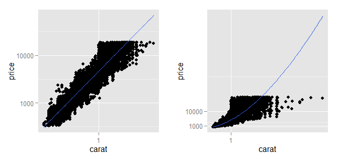

#### Polar system
For more details, see the document.

```r
pie <- ggplot(mtcars, aes(x=factor(1), fill=factor(cyl))) + geom_bar(width=1)
grid.arrange(
  pie,
  pie + coord_polar(),
  pie + coord_polar(theta="y"),
  ncol=3
)
```

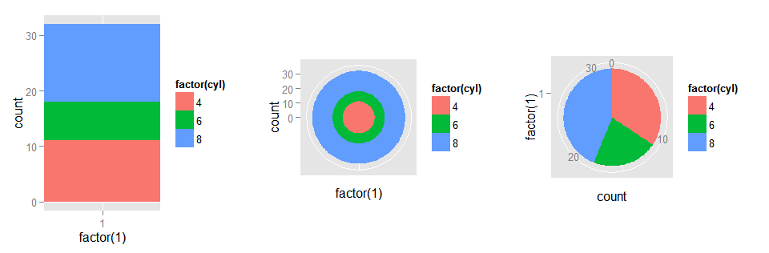

#Themes

There are two themes in ggplot. One is the default grey background with white gridlines while the other one is white background with grey gridlines.

```r
grid.arrange(
  ggplot(movies, aes(x=rating)) + geom_histogram(binwidth=1),
  ggplot(movies, aes(x=rating)) + geom_histogram(binwidth=1) + theme_bw(),
  ncol=2
)
```

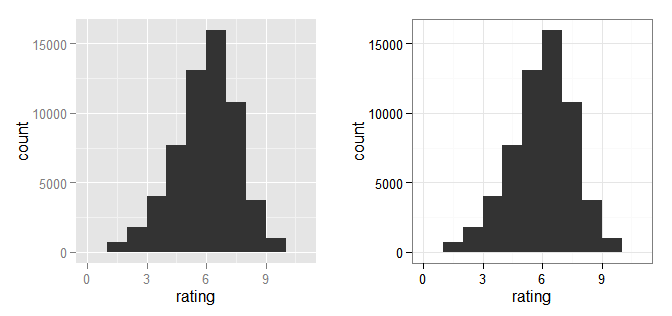

### Adjustment for text

```r
myhist <- ggplot(movies, aes(x=rating)) + geom_histogram(binwidth=1) + labs(title="Historgram")

grid.arrange(
  myhist,
  myhist + theme(plot.title=element_text(size=20)),
  myhist + theme(plot.title=element_text(size=20, color="red")),
  myhist + theme(plot.title=element_text(size=20, hjust=0)),
  myhist + theme(plot.title=element_text(size=20, face="bold")),
  myhist + theme(plot.title=element_text(size=20, angle=30)),
  ncol=3
)
```

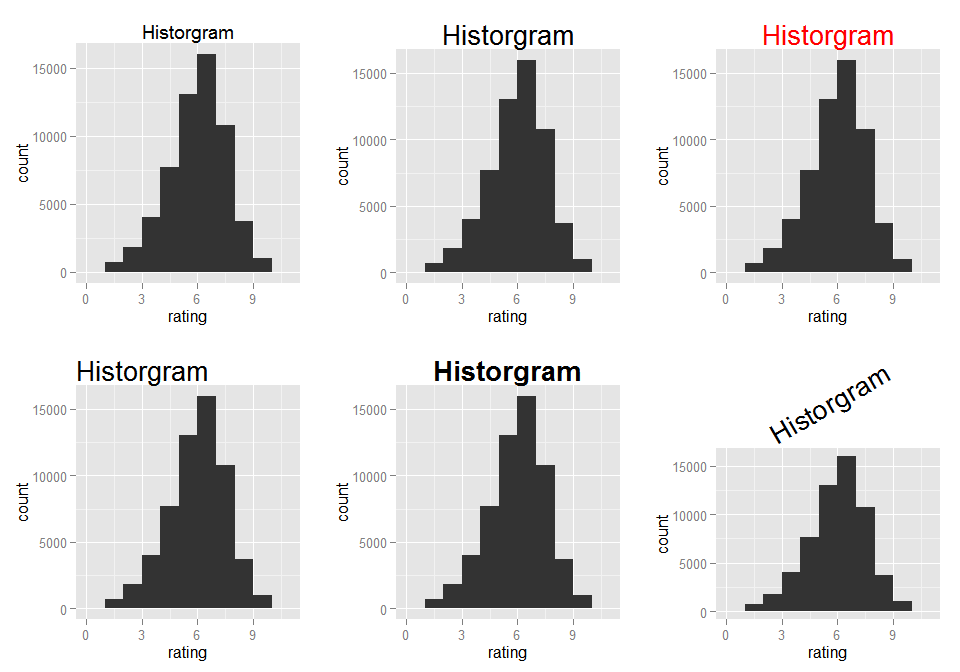

### Adjustment for gridlines and axis

```r
grid.arrange(
  myhist + theme(panel.grid.major=element_line(color="red", size=2)),
  myhist + theme(panel.grid.major=element_line(linetype="dotted")),
  myhist + theme(axis.line=element_line(color="red")),
  ncol=3
)
```

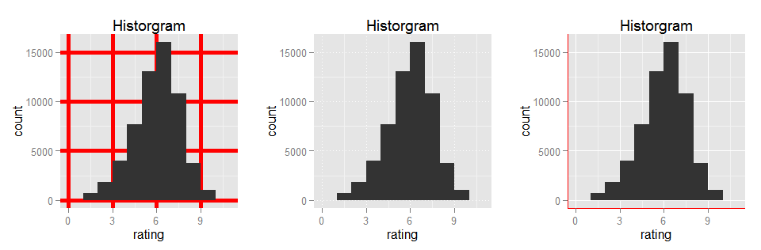

### Adjustment for rectangles and panel background

```r
grid.arrange(
  myhist + theme(plot.background=element_rect(fill="grey80", color=NA)),
  myhist + theme(plot.background=element_rect(size=2, color="red")),
  myhist + theme(panel.background=element_rect(fill="dodgerblue")),
  myhist + theme(panel.background=element_rect(fill=NA, color="blue", linetype="dashed")),
  #Use element_blank to remove the theme you don't want
  myhist + theme(panel.grid.major=element_blank()),
  myhist + theme(panel.background=element_blank()),
  ncol=3
)
```

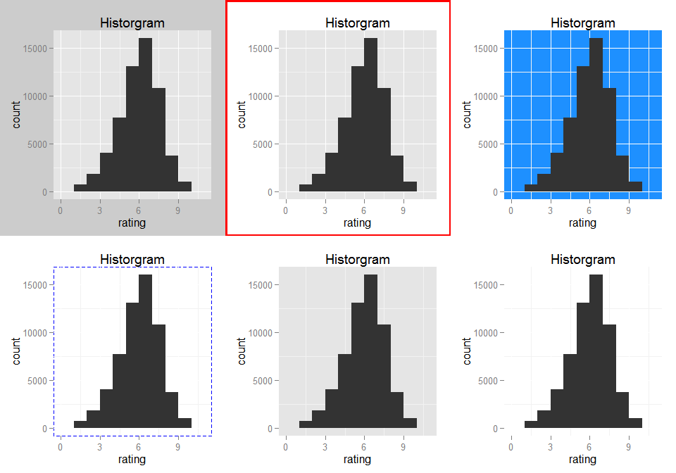

### Set up default theme

```r
mydata <- data.frame(x=rnorm(100), y=rnorm(100))
ggplot(mydata, aes(x=x, y=y)) + geom_point()
```

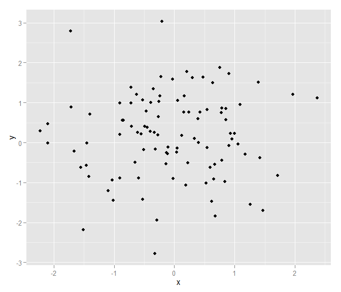


```r
matcha_theme <- theme_set(theme_bw())
theme_set(matcha_theme)
matcha_theme <- theme_update(
  plot.title=element_text(size=40, color="cadetblue1"),
  plot.background=element_rect(fill="olivedrab3"),
  panel.background=element_rect(fill="olivedrab3"),
  axis.text.x=element_text(colour="orchid3"),
  axis.text.y=element_text(colour="orchid3", hjust=1),
  axis.title.x=element_text(colour="orchid3", face="bold"),
  axis.title.y=element_text(colour="orchid3", face="bold", angle=90)
)
ggplot(mydata, aes(x=x, y=y)) + geom_point() + labs(title="OMG! It's Matcha!!!")
```

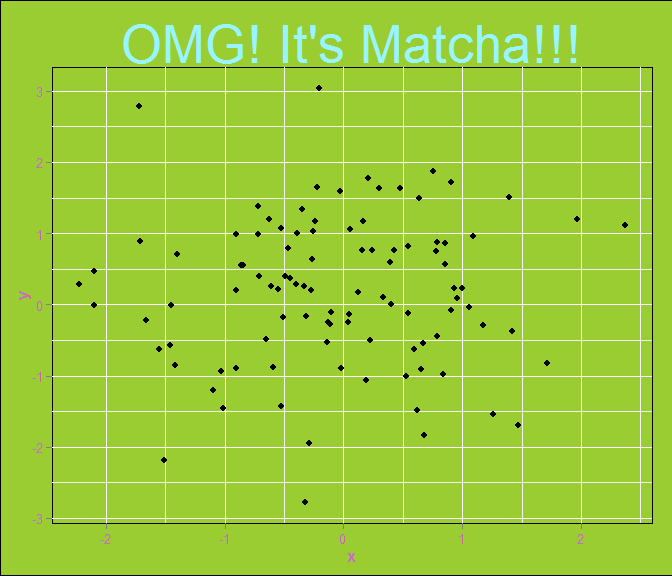

```r
#Get back to original theme
theme_set(theme_grey())
```


### Save your graph

Use `ggsave()` to save the graph. There are three arguments that you can adjust, height, width, and scale.
An alternative way is use the default function in R such as `png()` and `pdf()` and after finishing the plot, use `dev.off()` to close it. 

```r
ggplot(mydata, aes(x=x, y=y)) + geom_point()
ggsave(file="matcha.pdf")
```

### Multiple plot on same page

As you may notice, I have used the technique throughout this demo. Now we will focus on the subplot.
Here is the example for subplot.

```r
a <- ggplot(economics, aes(x=date, y=unemploy)) + geom_line()
b <- ggplot(economics, aes(x=uempmed, y=unemploy)) + geom_point() + geom_smooth(se=FALSE)
c <- ggplot(economics, aes(x=uempmed, y=unemploy)) + geom_path()
```


```r
csmall <- c + theme_gray(9) + labs(x = NULL, y = NULL) + theme(plot.margin = unit(rep(0, 4), "lines"))
subvp <- viewport(width = 0.4, height = 0.4, x = 0.75, y = 0.35)

b
```

```
geom_smooth: method="auto" and size of largest group is <1000, so using loess. Use 'method = x' to change the smoothing method.
```

```r
print(csmall, vp = subvp)
```

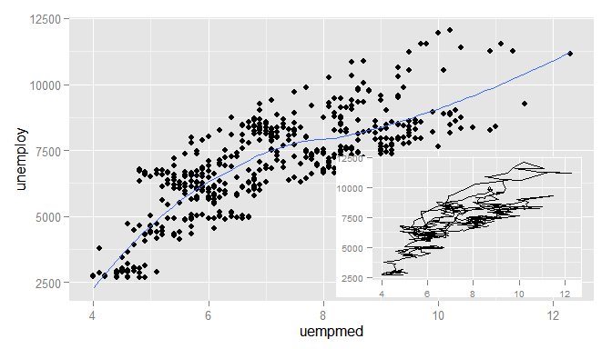


```r
#Another way to do multiple plot
pushViewport(viewport(layout = grid.layout(2, 2)))
vplayout <- function(x, y){
  viewport(layout.pos.row = x, layout.pos.col = y)
}

print(a, vp = vplayout(1, 1:2))
print(b, vp = vplayout(2, 1))
```

```
geom_smooth: method="auto" and size of largest group is <1000, so using loess. Use 'method = x' to change the smoothing method.
```

```r
print(c, vp = vplayout(2, 2))
```


```r
#The same code as previous
grid.arrange(a, arrangeGrob(b, c, ncol=2), nrow=2)
```

```
geom_smooth: method="auto" and size of largest group is <1000, so using loess. Use 'method = x' to change the smoothing method.
```

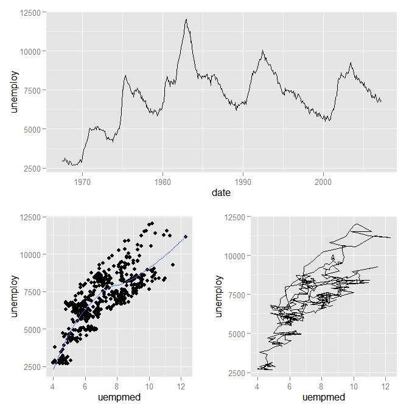

