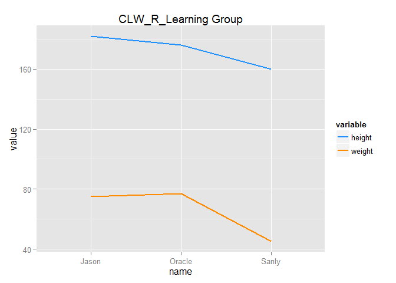

# Package: reshape2
Jason  
2015年7月8日  


```r
library(reshape2); library(ggplot2); library(dplyr)
```

`reshape2` is a package that provide functions for us to manipulate with the data. It is very good at transforming the data from *wide* format to *long* format or otherwise. 

The **wide** format is shown below. It means that a column in the data represent one variable/feature of the data. 

```r
data.frame(Var1=1:3, Var2=4:6, Var3=7:9)
```

```
  Var1 Var2 Var3
1    1    4    7
2    2    5    8
3    3    6    9
```
And this is the **long** format

```r
melt(data.frame(Var1=1:3, Var2=4:6, Var3=7:9))
```

```
No id variables; using all as measure variables
```

```
  variable value
1     Var1     1
2     Var1     2
3     Var1     3
4     Var2     4
5     Var2     5
6     Var2     6
7     Var3     7
8     Var3     8
9     Var3     9
```
Owing to the processing(dplyr) or grahp(ggplot), sometimes it will be very useful to transform the wide format data to long format. `reshape2` mainly provide two function to deal with two situation.

wide to long: `melt`
long to wide: `cast`
---

# melt
This is a toy example that I creat to use to illustrate the `melt`.

```r
#Toy data
our_team <- data.frame(name=c("Jason", "Oracle", "Sanly"),
                height=c(182, 176, 160),
                weight=c(75, 77, 45))
our_team
```

```
    name height weight
1  Jason    182     75
2 Oracle    176     77
3  Sanly    160     45
```
Q1. Plot the variable `height` & `weight` together and use the color to distinguish two variable.

```r
m <- melt(our_team, id="name")
m
```

```
    name variable value
1  Jason   height   182
2 Oracle   height   176
3  Sanly   height   160
4  Jason   weight    75
5 Oracle   weight    77
6  Sanly   weight    45
```
It mainly keep the variable you set in `id= ` and transform other variables to two column, one for varialbe and one for value.

```r
ggplot(m) + geom_line(aes(x=name, y=value, group=variable, color=variable), size=1) +
  labs(title="CLW_R_Learning Group") +
  scale_color_manual(values=c("#1E90FF", "#FF8C00"))
```



#cast

```r
our_team2 <- data.frame(name=rep(c("Jason", "Oracle", "Sanly"), 4),
                year=rep(c(2012, 2013, 2014, 2015), each=3),
                height=c(180:183, 173:176, 157:160),
                weight=c(85, 80, 75, 75, 60, 70, 75, 77, 47, 46, 45, 45))
our_team2
```

```
     name year height weight
1   Jason 2012    180     85
2  Oracle 2012    181     80
3   Sanly 2012    182     75
4   Jason 2013    183     75
5  Oracle 2013    173     60
6   Sanly 2013    174     70
7   Jason 2014    175     75
8  Oracle 2014    176     77
9   Sanly 2014    157     47
10  Jason 2015    158     46
11 Oracle 2015    159     45
12  Sanly 2015    160     45
```


```r
m2 <- melt(our_team2, id=c("name", "year"))
m2
```

```
     name year variable value
1   Jason 2012   height   180
2  Oracle 2012   height   181
3   Sanly 2012   height   182
4   Jason 2013   height   183
5  Oracle 2013   height   173
6   Sanly 2013   height   174
7   Jason 2014   height   175
8  Oracle 2014   height   176
9   Sanly 2014   height   157
10  Jason 2015   height   158
11 Oracle 2015   height   159
12  Sanly 2015   height   160
13  Jason 2012   weight    85
14 Oracle 2012   weight    80
15  Sanly 2012   weight    75
16  Jason 2013   weight    75
17 Oracle 2013   weight    60
18  Sanly 2013   weight    70
19  Jason 2014   weight    75
20 Oracle 2014   weight    77
21  Sanly 2014   weight    47
22  Jason 2015   weight    46
23 Oracle 2015   weight    45
24  Sanly 2015   weight    45
```
You can transform the data back to original by dcast.

```r
#Make it back to origin
d <- dcast(m2, name + year ~ variable)
d
```

```
     name year height weight
1   Jason 2012    180     85
2   Jason 2013    183     75
3   Jason 2014    175     75
4   Jason 2015    158     46
5  Oracle 2012    181     80
6  Oracle 2013    173     60
7  Oracle 2014    176     77
8  Oracle 2015    159     45
9   Sanly 2012    182     75
10  Sanly 2013    174     70
11  Sanly 2014    157     47
12  Sanly 2015    160     45
```
Another way to do it.

```r
dcast(m2, ... ~ variable)
```

```
     name year height weight
1   Jason 2012    180     85
2   Jason 2013    183     75
3   Jason 2014    175     75
4   Jason 2015    158     46
5  Oracle 2012    181     80
6  Oracle 2013    173     60
7  Oracle 2014    176     77
8  Oracle 2015    159     45
9   Sanly 2012    182     75
10  Sanly 2013    174     70
11  Sanly 2014    157     47
12  Sanly 2015    160     45
```

It also includes some aggregation funciton.

```r
dcast(m2, name ~ variable, mean)
```

```
    name height weight
1  Jason 174.00  70.25
2 Oracle 172.25  65.50
3  Sanly 168.25  59.25
```
Use `margins` to calculate all value for each row and column

```r
dcast(m2, name ~ variable, mean, margins=TRUE)
```

```
    name height weight   (all)
1  Jason 174.00  70.25 122.125
2 Oracle 172.25  65.50 118.875
3  Sanly 168.25  59.25 113.750
4  (all) 171.50  65.00 118.250
```
If you just want the margin of name:

```r
dcast(m2, name ~ variable, mean, margins="variable")
```

```
    name height weight   (all)
1  Jason 174.00  70.25 122.125
2 Oracle 172.25  65.50 118.875
3  Sanly 168.25  59.25 113.750
```
You can get the same answer by using dplyr as below.

```r
our_team2 %>%
  group_by(name) %>%
  summarise(height=mean(height), weight=mean(weight))
```

```
Source: local data frame [3 x 3]

    name height weight
1  Jason 174.00  70.25
2 Oracle 172.25  65.50
3  Sanly 168.25  59.25
```
You can also use the `acast` to obtain a higher dimensional array. (Change the order in formula will give you different result, you can play it around)

```r
acast(m2, name ~ year ~ variable)
```

```
, , height

       2012 2013 2014 2015
Jason   180  183  175  158
Oracle  181  173  176  159
Sanly   182  174  157  160

, , weight

       2012 2013 2014 2015
Jason    85   75   75   46
Oracle   80   60   77   45
Sanly    75   70   47   45
```

