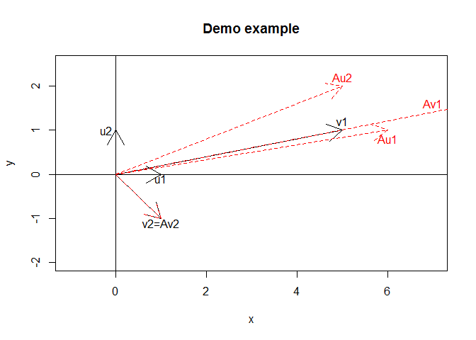

# Eigenvalue & Eigenvector
Jason  
2015年7月12日  


```r
m <- matrix(c(6, 5, 1, 2), ncol=2, byrow=TRUE)
m
```

```
     [,1] [,2]
[1,]    6    5
[2,]    1    2
```
When you multiple a vector by a matrix, it means that you are rotating and stretching the vector. The eigenvetcors are some special cases that when you multipe it with a matrix, the direction of the vector will not change. The effect of the transition matrix is only increasing or decreasing the length of the vector, and the amount of the vector decreasing or increasing are the eigenvalues. 

```r
u1 <- c(1, 0); u2 <- c(0, 1)
plot(u1, u2, type="n", xlab="x", ylab="y",
     main="Demo example", xlim=c(-1, 7), ylim=c(-2, 2.5))
abline(h=0, v=0)
#u1, u2
arrows(0, 0, 1, 0); arrows(0, 0, 0, 1)
text(1, -0.1, "u1"); text(-0.2, 1, "u2")
#v1, v2
arrows(0, 0, 5, 1); arrows(0, 0, 1, -1)
text(5, 1.2, "v1"); text(1, -1.1, "v2=Av2")

#Au1, Au2
arrows(0, 0, 6, 1, lty=2, col="red"); arrows(0, 0, 5, 2, lty=2, col="red")
text(6, 0.8, "Au1", col="red"); text(5, 2.2, "Au2", col="red")
#Av1, Av2
arrows(0, 0, 35, 7, lty=2, col="red"); arrows(0, 0, 1, -1, lty=2, col="red")
text(7, 1.6, "Av1", col="red")
```




```r
eigen(m)
```

```
$values
[1] 7 1

$vectors
          [,1]       [,2]
[1,] 0.9805807 -0.7071068
[2,] 0.1961161  0.7071068
```
#1. Eigenvectors of the symmetric matrix are orthogonal. 
$\lambda_{1}, \lambda_{2}$ are eigenvalues of symmetric matrix.
$v_{1}, v_{2}$ are eigenvectors of symmetric matrix A.
$\lambda_{1}v_{2}^{T}v_{1}=v_{2}^{T}\lambda_{1}v_{1}=v_{2}^{T}Av_{1}=(A^{T}v_{2})^{T}v_{1}=(Av_{2}^{T})v_{1}=\lambda_{2}v_{2}^{T}v_{1}$

```r
m2 <- matrix(c(1, 3, 3, 1), ncol=2, byrow=TRUE)
eigen(m2)
```

```
$values
[1]  4 -2

$vectors
          [,1]       [,2]
[1,] 0.7071068 -0.7071068
[2,] 0.7071068  0.7071068
```


```r
eigen(matrix(c(1, 4, 4, 1), ncol=2, byrow=TRUE))
```

```
$values
[1]  5 -3

$vectors
          [,1]       [,2]
[1,] 0.7071068 -0.7071068
[2,] 0.7071068  0.7071068
```

```r
eigen(matrix(c(1, 6, 6, 1), ncol=2, byrow=TRUE))
```

```
$values
[1]  7 -5

$vectors
          [,1]       [,2]
[1,] 0.7071068 -0.7071068
[2,] 0.7071068  0.7071068
```

```r
eigen(matrix(c(2, 3, 3, 2), ncol=2, byrow=TRUE))
```

```
$values
[1]  5 -1

$vectors
          [,1]       [,2]
[1,] 0.7071068 -0.7071068
[2,] 0.7071068  0.7071068
```


#2. Sum of eigenvalues is the trace of the matrix (diagonal elements of matrix) and product of eigenvalues is the determinat of the matrx
pf: By polynomial expansion.

```r
e1 <- matrix(sample(1:9, 9, replace=F), ncol=3, byrow=T)
e1
```

```
     [,1] [,2] [,3]
[1,]    9    2    1
[2,]    3    5    8
[3,]    7    6    4
```


```r
#trace
data.frame(trace=sum(diag(e1)), eigen=sum(eigen(e1)$value))
```

```
  trace eigen
1    18    18
```


```r
#determinat
data.frame(det=det(e1), eigen=prod(eigen(e1)$value))
```

```
   det eigen
1 -181  -181
```

#3. eigenspace of the real symmetric matrix are orthogonal matrix
The orthogonal matrix A mean that all length of the column and row vectors are sum to 1 and the A^{T}=A^{-1} (Do not consider complex solution here.)

```r
eigen(m2)$vectors
```

```
          [,1]       [,2]
[1,] 0.7071068 -0.7071068
[2,] 0.7071068  0.7071068
```


```r
solve(eigen(m2)$vectors)
```

```
           [,1]      [,2]
[1,]  0.7071068 0.7071068
[2,] -0.7071068 0.7071068
```

Reference:

* [Eigenvectors and eigenvalues - MIT](https://www.google.com.tw/url?sa=t&rct=j&q=&esrc=s&source=web&cd=5&cad=rja&uact=8&ved=0CEIQFjAE&url=http%3A%2F%2Fweb.mit.edu%2Fjorloff%2Fwww%2F18.03-esg%2Fnotes%2Feigen.pdf&ei=GoKiVbrkC9aSuAT_spn4Cg&usg=AFQjCNE0vRnmEz7nKEVi80JuTX511pCDuA&sig2=j4GLZxgnWg3e0ISFRrTjYA&bvm=bv.97653015,d.dGo)
* [Symmetric matrices](http://www.doc.ic.ac.uk/~ae/papers/lecture05.pdf)
* [Properties of Eigenvalues and Eigenvectors](http://linear.ups.edu/html/section-PEE.html)
