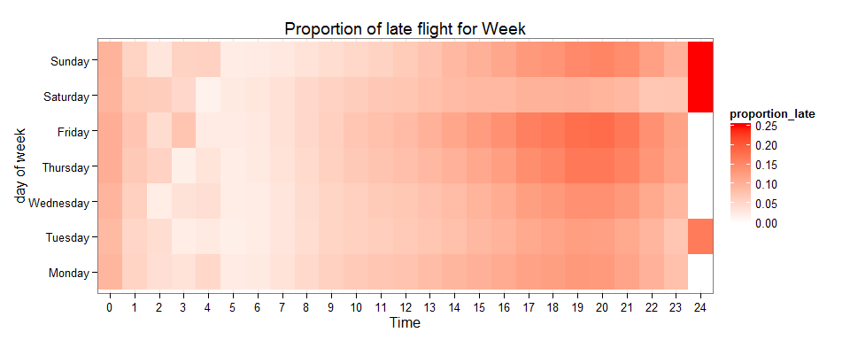
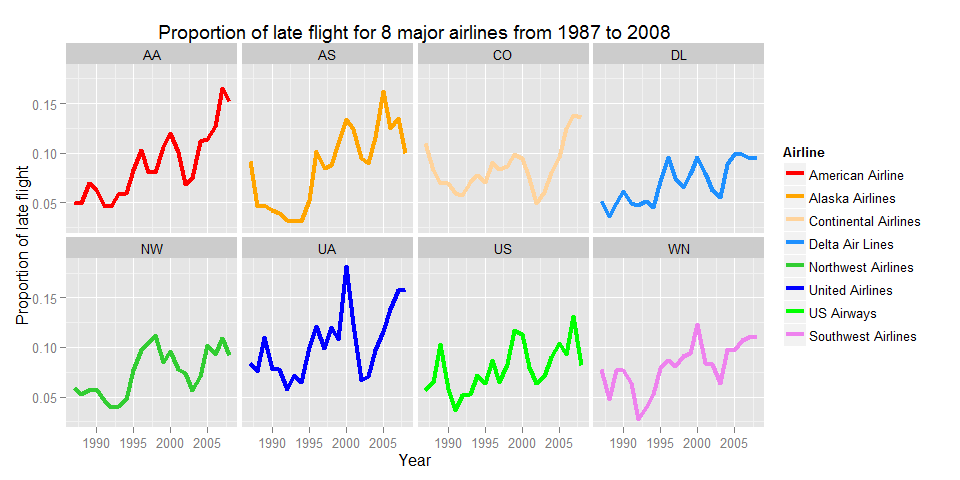
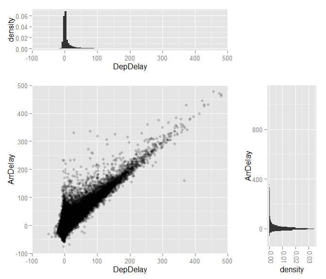
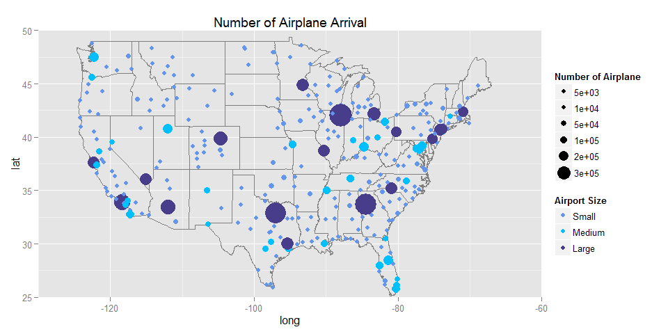
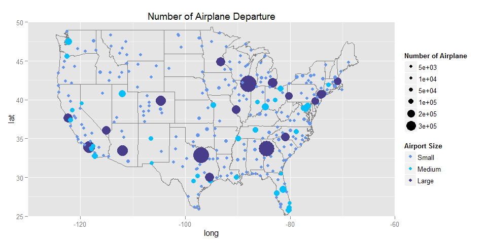
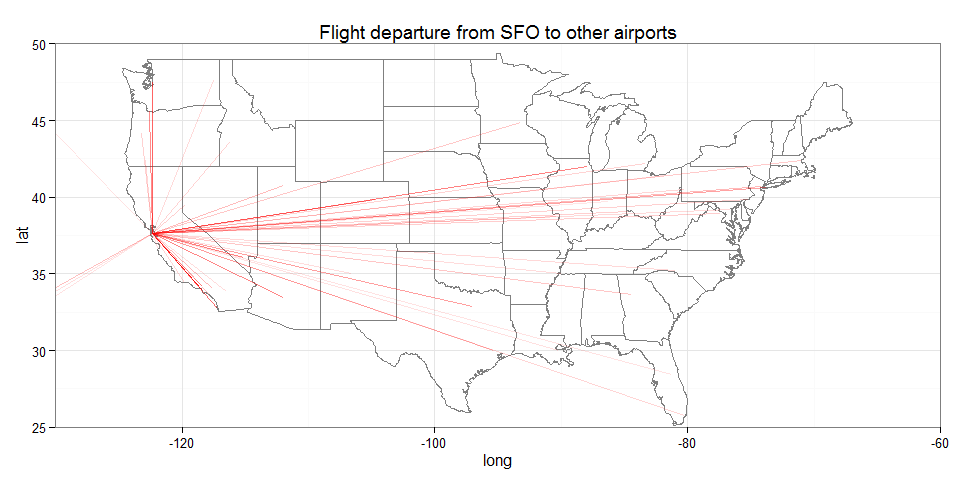

# ggplot2-airline dataset
Chih Hui(Jason) Wang  
November 17, 2015  


```r
library(RSQLite)
library(ggplot2)
library(grid)
library(gridExtra)
library(dplyr)
library(reshape2)
```


```r
#Connect database
db <- dbConnect(SQLite(), "C:/Users/jason/Documents/Airline/airline.db")
```

## Proportion of late for a week according to past data


```r
view1 <- "
create view flight as
select CRSDeptime/100 as Hour, DayofWeek, DepDelay
from Sairline
where DepDelay < 1440
"

#Send Query to create view(read only)
dbSendQuery(db, view1)

#Check whether we successfully create view
dbListTables(db)
```


```r
query1 <- "
select Hour, DayofWeek, AVG(DepDelay > 30) as proportion_late
from flight
group by Hour, DayofWeek
"

system.time(data <- dbGetQuery(db, query1))
```

```
   user  system elapsed 
  25.44    5.30   31.08 
```


```r
myweek <- function(x){
  week <- c("Monday", "Tuesday", "Wednesday", "Thursday",
            "Friday", "Saturday", "Sunday")
  week[x]
}

#Transform DayofWeek into Mon...Sun
data$DayofWeek <- myweek(data$DayofWeek)
data$DayofWeek <- factor(data$DayofWeek, levels=myweek(1:7))

g1 <- ggplot(data, aes(x=Hour, y=DayofWeek, fill=proportion_late)) + geom_tile()

g1 + scale_fill_continuous(low="white", high="red") + scale_x_continuous(breaks=0:24) + coord_cartesian(xlim=c(-0.5, 24.5)) + labs(x="Time", y="day of week", title="Proportion of late flight for Week") + theme_bw()
```



## Proportion of late for major airlines


```r
query2 <- "
select Year, UniqueCarrier, AVG(DepDelay > 30) as proportion_late
from Sairline
group by Year, UniqueCarrier
"

system.time(data <- dbGetQuery(db, query2))
```

```
   user  system elapsed 
  16.29    4.69   21.03 
```

```r
t <- table(data$UniqueCarrier)
t
```

```

    9E     AA     AQ     AS     B6     CO     DH     DL     EA     EV 
     2     22      5     22      6     22      3     22      4      6 
    F9     FL     HA     HP ML (1)     MQ     NW     OH     OO PA (1) 
     4      6      6     19      1      8     22      5      6      5 
    PI     PS     TW     TZ     UA     US     WN     XE     YV 
     3      2     15      4     22     22     22      6      3 
```


```r
#Get the major airline name
major_air <- names(t)[which(t == 22)]

data <- subset(data, UniqueCarrier %in% major_air)
head(data)
```

```
   Year UniqueCarrier proportion_late
1  1987            AA      0.05044128
2  1987            AS      0.09155262
3  1987            CO      0.11005063
4  1987            DL      0.05104484
7  1987            NW      0.05858094
12 1987            UA      0.08405389
```


```r
g2 <- ggplot(data, aes(x=Year, y=proportion_late, color=UniqueCarrier)) + geom_line(size=1.5) + facet_wrap(~ UniqueCarrier, ncol=4)

#Change color and label name
color <- c(AA="red", AS="orange", CO="burlywood1", DL="dodgerblue", NW="limegreen", UA="blue", US="green", WN="violet")

#Airline name
airname <- c("American Airline", "Alaska Airlines", "Continental Airlines", "Delta Air Lines", "Northwest Airlines", "United Airlines", "US Airways", "Southwest Airlines")

g2 + scale_color_manual("Airline", values=color, labels=airname) + labs(title="Proportion of late flight for 8 major airlines from 1987 to 2008", x="Year", y="Proportion of late flight")
```



## DepDelay versus ArrDelay

```r
query3 <- "
select DepDelay, ArrDelay
from Sairline
where ArrDelay != 'NA'
"

system.time(data <- dbGetQuery(db, query3))
```

```
   user  system elapsed 
   5.47    2.20    7.69 
```


```r
set.seed(0)
#Get a small data to examine the relationship between two variables
data_sample <- data %>% sample_frac(0.01)
g3 <- ggplot(data_sample, aes(x=DepDelay, y=ArrDelay)) + geom_point(shape=16, alpha=1/5) + coord_cartesian(xlim=c(-100, 500), ylim=c(-100, 500))

hist1 <- ggplot(data_sample, aes(x=DepDelay)) + geom_histogram(aes(y=..density..), binwidth=5) + coord_cartesian(xlim=c(-100, 500)) 
hist2 <- ggplot(data_sample, aes(x=ArrDelay)) + geom_histogram(aes(y=..density..), binwidth=5) + coord_cartesian(xlim=c(-100, 500)) + theme(axis.text.x = element_text(angle = 270, vjust=0.15)) + coord_flip()
```


```r
#Create a empty plot
empty <- ggplot()+geom_point(aes(1,1), colour="white") +
     theme(                              
       plot.background = element_blank(), 
       panel.grid.major = element_blank(), 
       panel.grid.minor = element_blank(), 
       panel.border = element_blank(), 
       panel.background = element_blank(),
       axis.title.x = element_blank(),
       axis.title.y = element_blank(),
       axis.text.x = element_blank(),
       axis.text.y = element_blank(),
       axis.ticks = element_blank()
)
```


```r
grid.arrange(hist1, empty, g3, hist2, ncol=2, widths=c(4, 1.5), heights=c(1.5, 4))
```




```r
view2 <- "
create view destination as 
select Dest, Count(*) as Count1
from Sairline
group by Dest
"

view3 <- "
create view origin as 
select Origin, Count(*) as Count2
from Sairline
group by Origin
"

dbSendQuery(db, view2); dbSendQuery(db, view3)

#Check whether we successfully create view
dbListTables(db)
```

## Airport traffic


```r
#Only get the airport appear both in destination and origin
query4 <- "
select Origin as airport, Count1, Count2
from destination as d, origin as o
where d.Dest = o.Origin"

system.time(data <- dbGetQuery(db, query4))
```

```
   user  system elapsed 
  42.54    8.10   50.69 
```


```r
airports <- read.csv("C:/Users/jason/Desktop/R/CLW_R_Learning/Jason Wang/airports.csv")

#We only need the longitude, latitude
airports <- airports[c('iata', 'country', 'lat', 'long')]
names(airports)[1] <- "airport"

#Merge two data set
data <- merge(airports, data)

#Keep the airport only in the USA
data <- data %>% filter(country == "USA")

#Create Categorical variable for small, medium, large airport
data$Group1 <- cut(data$Count1, breaks=c(0, 50000, 200000, Inf), include.lowest=TRUE)
levels(data$Group1) <- c("Small", "Medium", "Large")

data$Group2 <- cut(data$Count1, breaks=c(0, 50000, 200000, Inf), include.lowest=TRUE)
levels(data$Group2) <- c("Small", "Medium", "Large")
```


```r
color <- c(Small="cornflowerblue", Medium="deepskyblue", Large="darkslateblue")
breaks <- c(0, 5000, 10000, 50000, 100000, 200000, 300000, Inf)

ggplot() + borders("state", size=0.5) + geom_point(data=data, aes(x=long, y=lat, size=Count1, color=Group1)) + scale_size_continuous("Number of Airplane", breaks=breaks, range=c(2, 12)) + scale_color_manual("Airport Size", values=color) + coord_cartesian(xlim=c(-130, -60), ylim=c(25, 50)) + labs(title="Number of Airplane Arrival")
```




```r
ggplot() + borders("state", size=0.5) + geom_point(data=data, aes(x=long, y=lat, size=Count2, color=Group2)) + scale_size_continuous("Number of Airplane", breaks=breaks, range=c(2, 12)) + scale_color_manual("Airport Size", values=color) + coord_cartesian(xlim=c(-130, -60), ylim=c(25, 50)) + labs(title="Number of Airplane Departure")
```




```r
query5 <- "
select Year, Dest, Origin, count(*) as Count  
from Sairline
group by Year, Dest, Origin
"

system.time(data <- dbGetQuery(db, query5))
```

```
   user  system elapsed 
  29.05    5.22   35.03 
```


```r
#Get the longitude and latitude of Destination
data <- merge(data, airports, by.x="Origin", by.y="airport")

#Get the longitude and latitude of Origin
data <- merge(data, airports, by.x="Dest", by.y="airport")

head(data)
```

```
  Dest Origin Year Count country.x    lat.x    long.x country.y    lat.y
1  ABE    ATL 1997    63       USA 33.64044 -84.42694       USA 40.65236
2  ABE    ORD 2006   152       USA 41.97960 -87.90446       USA 40.65236
3  ABE    ORD 2005    22       USA 41.97960 -87.90446       USA 40.65236
4  ABE    CLT 2006    38       USA 35.21401 -80.94313       USA 40.65236
5  ABE    MDT 1996    85       USA 40.19350 -76.76340       USA 40.65236
6  ABE    ATL 1990    68       USA 33.64044 -84.42694       USA 40.65236
    long.y
1 -75.4404
2 -75.4404
3 -75.4404
4 -75.4404
5 -75.4404
6 -75.4404
```


```r
#Airflight within USA
data <- data %>% filter(country.x == 'USA', country.y == 'USA')

#Remove unneeded column
data <- data[, c(1, 2, 3, 4, 6, 7, 9, 10)]

data_O <- data[, c(-7, -8)] 
names(data_O)[5:6] <- c("lat", "long")
data_D <- data[, c(-5, -6)]
names(data_D)[5:6] <- c("lat", "long")

data <- rbind(data_O, data_D)

#Add group
data$group <- rep(1:(nrow(data)/2), 2)

#Origin location
head(data)
```

```
  Dest Origin Year Count      lat      long group
1  ABE    ATL 1997    63 33.64044 -84.42694     1
2  ABE    ORD 2006   152 41.97960 -87.90446     2
3  ABE    ORD 2005    22 41.97960 -87.90446     3
4  ABE    CLT 2006    38 35.21401 -80.94313     4
5  ABE    MDT 1996    85 40.19350 -76.76340     5
6  ABE    ATL 1990    68 33.64044 -84.42694     6
```


```r
#Destination location
data[80735:80740, ]
```

```
      Dest Origin Year Count      lat     long group
80735  ABE    ATL 1997    63 40.65236 -75.4404     1
80736  ABE    ORD 2006   152 40.65236 -75.4404     2
80737  ABE    ORD 2005    22 40.65236 -75.4404     3
80738  ABE    CLT 2006    38 40.65236 -75.4404     4
80739  ABE    MDT 1996    85 40.65236 -75.4404     5
80740  ABE    ATL 1990    68 40.65236 -75.4404     6
```


```r
SFO <- data %>% filter(Year == 1996, Origin == "SFO")

ggplot() + borders("state", size=0.5) + geom_path(data=SFO, aes(x=long, y=lat, group=group, alpha=Count), color="red") + coord_cartesian(xlim=c(-130, -60), ylim=c(25, 50)) + labs(title="Flight departure from SFO to other airports") + theme_bw() + theme(legend.position="none")
```



