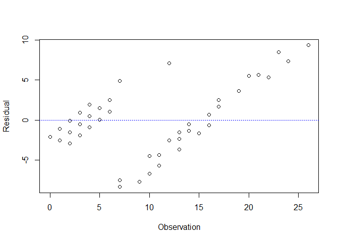
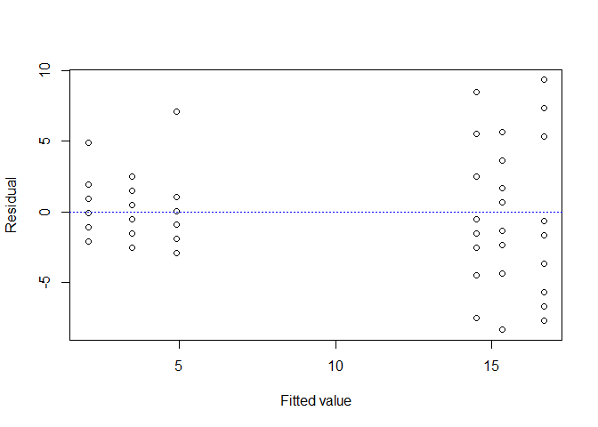
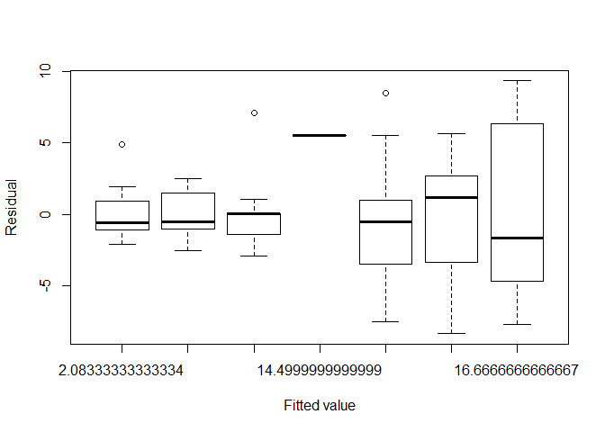
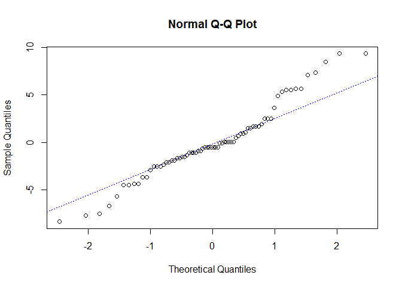

# DIAGNOSIS
HsuanU (Sanly)  


```r
#Test the assumption of error~iid N(0, var)
#packages:
library (lmtest) #for Durbin-Watson test 
library(stats)   #for Bartlett test and Kolmogorov?VSmirnov test  
library (lawstat)#for Levene test
```


```r
samplex <- InsectSprays$spray #class
sampley <- InsectSprays$count 
lm1 <- lm (sampley~as.factor(samplex))
```
#Independence

```r
plot (lm1$residual~sampley, xlab="Observation", ylab="Residual") #I will try ggplot next time
abline(h=0, lty=3, col="blue")
```

 

```r
dwtest (sampley~samplex)
```

```
## 
## 	Durbin-Watson test
## 
## data:  sampley ~ samplex
## DW = 1.7534, p-value = 0.04805
## alternative hypothesis: true autocorrelation is greater than 0
```
#Constant variance

```r
#當資料分佈是常態時， Bartlett法是很好的方法，但是它對分佈型態很敏感。
#依據 Conover etc. (1981), Levene檢定法不受限於資料之分佈，或許是較適當的方法。
#這些檢定要求至少兩個y share同一個x值
plot (lm1$residual~lm1$fitted.value, xlab="Fitted value", ylab="Residual")
abline(h=0, lty=3, col="blue")
```

 

```r
#Maybe it is more proper to use a boxplot
boxplot (lm1$residual~lm1$fitted.value, xlab="Fitted value", ylab="Residual")
```

 

```r
bartlett.test(sampley~samplex)
```

```
## 
## 	Bartlett test of homogeneity of variances
## 
## data:  sampley by samplex
## Bartlett's K-squared = 25.9598, df = 5, p-value = 9.085e-05
```

```r
levene.test (sampley, samplex, location="median", correction.method="zero.correction")
```

```
## 
## 	modified robust Brown-Forsythe Levene-type test based on the
## 	absolute deviations from the median with modified structural zero
## 	removal method and correction factor
## 
## data:  sampley
## Test Statistic = 4.3388, p-value = 0.001951
```
#Normality

```r
qqnorm (lm1$residual)
qqline (lm1$residual, lty=3, col="blue")
```

 

```r
ks.test(samplex, sampley)
```

```
## Warning in ks.test(samplex, sampley): cannot compute exact p-value with
## ties
```

```
## 
## 	Two-sample Kolmogorov-Smirnov test
## 
## data:  samplex and sampley
## D = 0.5278, p-value = 3.9e-09
## alternative hypothesis: two-sided
```
