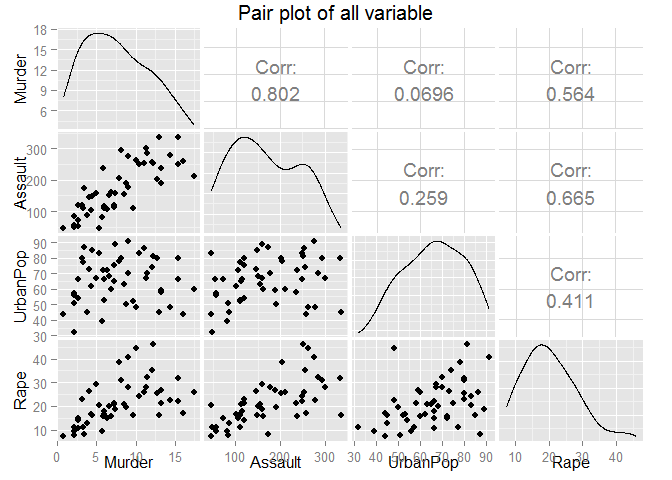
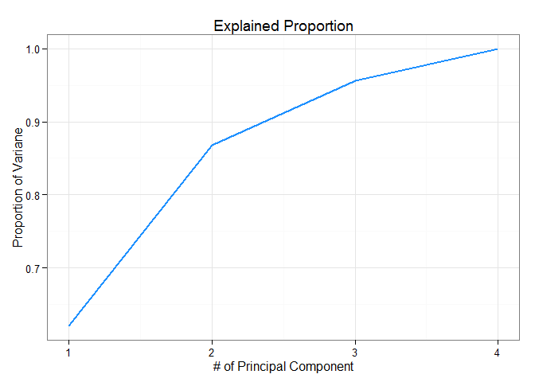
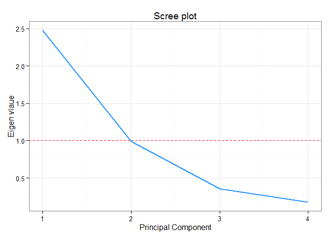
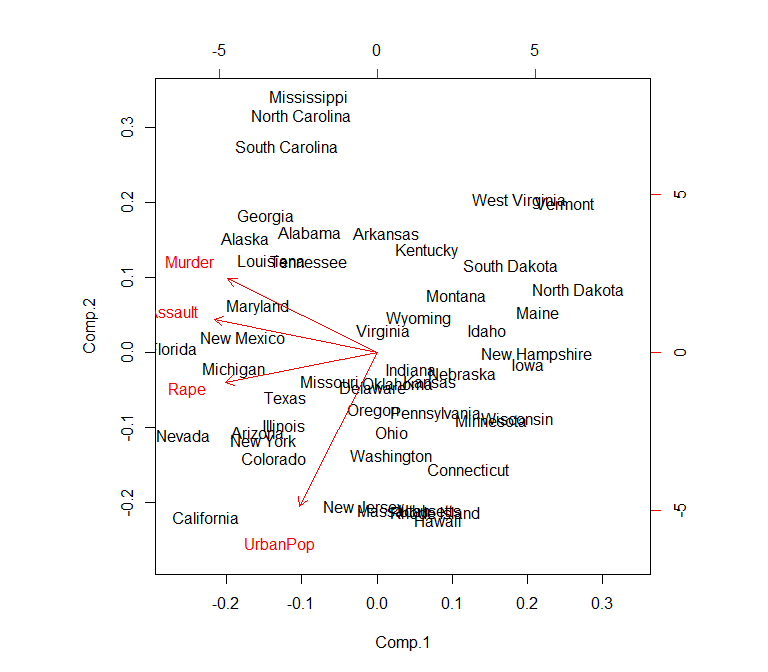

# Principal Component Analysis
Jason  
2015/07/03  


```r
#Package
library(ISLR); library(ggplot2); library(GGally)
```


```r
arrest <- USArrests
summary(arrest)
```

```
     Murder          Assault         UrbanPop          Rape      
 Min.   : 0.800   Min.   : 45.0   Min.   :32.00   Min.   : 7.30  
 1st Qu.: 4.075   1st Qu.:109.0   1st Qu.:54.50   1st Qu.:15.07  
 Median : 7.250   Median :159.0   Median :66.00   Median :20.10  
 Mean   : 7.788   Mean   :170.8   Mean   :65.54   Mean   :21.23  
 3rd Qu.:11.250   3rd Qu.:249.0   3rd Qu.:77.75   3rd Qu.:26.18  
 Max.   :17.400   Max.   :337.0   Max.   :91.00   Max.   :46.00  
```


```r
#The function is built in GGally
ggpairs(arrest, title="Pair plot of all variable")
```



# Step of Calculating PCA   
1. Scale the data

```r
scale_arrest <- scale(arrest)
```
2. Get the covariance matrix

```r
cov_arrest <- cov(scale_arrest)
cov_arrest
```

```
             Murder   Assault   UrbanPop      Rape
Murder   1.00000000 0.8018733 0.06957262 0.5635788
Assault  0.80187331 1.0000000 0.25887170 0.6652412
UrbanPop 0.06957262 0.2588717 1.00000000 0.4113412
Rape     0.56357883 0.6652412 0.41134124 1.0000000
```
3. Calculate eigenvalues and eigenvectors

```r
eigen_arrest <- eigen(cov_arrest)
eigen_arrest
```

```
$values
[1] 2.4802416 0.9897652 0.3565632 0.1734301

$vectors
           [,1]       [,2]       [,3]        [,4]
[1,] -0.5358995  0.4181809 -0.3412327  0.64922780
[2,] -0.5831836  0.1879856 -0.2681484 -0.74340748
[3,] -0.2781909 -0.8728062 -0.3780158  0.13387773
[4,] -0.5434321 -0.1673186  0.8177779  0.08902432
```
4. Derive the new data (scores)

Final Data=Row Feature Vector X Row Data Adjust

```r
scores <- t(t(eigen_arrest$vectors) %*% t(scale_arrest))

head(scores)
```

```
                 [,1]       [,2]        [,3]         [,4]
Alabama    -0.9756604  1.1220012 -0.43980366  0.154696581
Alaska     -1.9305379  1.0624269  2.01950027 -0.434175454
Arizona    -1.7454429 -0.7384595  0.05423025 -0.826264240
Arkansas    0.1399989  1.1085423  0.11342217 -0.180973554
California -2.4986128 -1.5274267  0.59254100 -0.338559240
Colorado   -1.4993407 -0.9776297  1.08400162  0.001450164
```
\newpage

5. Choose the number of Component

a. Proportion of variance

Random vector 
\begin{displaymath}
\mathbf{X} = \begin{bmatrix}
- X_{1} -\\ 
- X_{2} -\\ 
\cdots \\ 
- X_{n} -\\
\end{bmatrix}
\end{displaymath}
$$Cov(a'X)=a'Cov(X)a$$
$\phi_{1}$ is the first eigenvector
$$Var(\phi_{1}'X)=\phi_{1}'Var\phi_{1}=\phi_{1}'\lambda_{1}\phi_{1}=\lambda_{1}\phi_{1}'\phi_{1}=\lambda_{1}$$

```r
t(eigen_arrest$vectors[, 1]) %*% var(scale_arrest) %*% eigen_arrest$vectors[, 1]
```

```
         [,1]
[1,] 2.480242
```


```r
eigen_arrest$values[1]
```

```
[1] 2.480242
```
After the project the original data to the component one. We can explained the origianl variation by eigenvalue1, $\lambda_{1}$. Hence, we can use the eigenvalue to see how much variation the component explain.

```r
#Way1
eigen_value <- eigen_arrest$values
m <- data.frame(PC=1:4, PV=cumsum(eigen_value)/sum(eigen_value))

#plot
ggplot(m) + geom_line(aes(x=PC, y=PV), size=1, color="dodgerblue") +
  labs(title="Explained Proportion", x="# of Principal Component", y="Proportion of Variane") +
  theme_bw()
```


```r
#Way2
PV_each <- apply(scores^2, 2, sum)/sum(scale_arrest^2)
PV <- cumsum(PV_each)
m <- data.frame(PC=1:4, PV=PV)

#plot
ggplot(m) + geom_line(aes(x=PC, y=PV), size=1, color="dodgerblue") +
  labs(title="Explained Proportion", x="# of Principal Component", y="Proportion of Variane") +
  theme_bw()
```



b. Scree plot

```r
eigen_value <- eigen_arrest$values
data <- data.frame(Principal_component=1:4, eigenvalue=eigen_value)
#plot
ggplot(data) + geom_line(aes(x=Principal_component, y=eigen_value), size=1, color="dodgerblue") +
  labs(title="Scree plot", x="Principal Component", y="Eigen vlaue") +
  theme_bw() + geom_hline(yintercept=1, linetype=2, color="red")
```



# Default function

There are two default functions to do Principal Component Analysis in R, which is `princomp` and `prcomp`. In the following discussion, we will split them into different section and compare their difference.   


# princomp

```r
pca1 <- princomp(scale_arrest)
```


```r
summary(pca1)
```

```
Importance of components:
                          Comp.1    Comp.2    Comp.3     Comp.4
Standard deviation     1.5590500 0.9848705 0.5911277 0.41226385
Proportion of Variance 0.6200604 0.2474413 0.0891408 0.04335752
Cumulative Proportion  0.6200604 0.8675017 0.9566425 1.00000000
```


```r
#eigen value
pca1$sdev^2
```

```
   Comp.1    Comp.2    Comp.3    Comp.4 
2.4306367 0.9699698 0.3494319 0.1699615 
```


```r
#loading
pca1$loadings
```

```

Loadings:
         Comp.1 Comp.2 Comp.3 Comp.4
Murder   -0.536  0.418 -0.341  0.649
Assault  -0.583  0.188 -0.268 -0.743
UrbanPop -0.278 -0.873 -0.378  0.134
Rape     -0.543 -0.167  0.818       

               Comp.1 Comp.2 Comp.3 Comp.4
SS loadings      1.00   1.00   1.00   1.00
Proportion Var   0.25   0.25   0.25   0.25
Cumulative Var   0.25   0.50   0.75   1.00
```


```r
#Score
head(summary(pca1)$score)
```

```
               Comp.1     Comp.2      Comp.3       Comp.4
Alabama    -0.9756604  1.1220012 -0.43980366  0.154696581
Alaska     -1.9305379  1.0624269  2.01950027 -0.434175454
Arizona    -1.7454429 -0.7384595  0.05423025 -0.826264240
Arkansas    0.1399989  1.1085423  0.11342217 -0.180973554
California -2.4986128 -1.5274267  0.59254100 -0.338559240
Colorado   -1.4993407 -0.9776297  1.08400162  0.001450164
```


```r
biplot(pca1)
```



# prcomp

```r
pca2 <- prcomp(scale_arrest)
```


```r
summary(pca2)
```

```
Importance of components:
                          PC1    PC2     PC3     PC4
Standard deviation     1.5749 0.9949 0.59713 0.41645
Proportion of Variance 0.6201 0.2474 0.08914 0.04336
Cumulative Proportion  0.6201 0.8675 0.95664 1.00000
```


```r
pca2$sdev^2
```

```
[1] 2.4802416 0.9897652 0.3565632 0.1734301
```


```r
#loading
pca2$rotation
```

```
                PC1        PC2        PC3         PC4
Murder   -0.5358995  0.4181809 -0.3412327  0.64922780
Assault  -0.5831836  0.1879856 -0.2681484 -0.74340748
UrbanPop -0.2781909 -0.8728062 -0.3780158  0.13387773
Rape     -0.5434321 -0.1673186  0.8177779  0.08902432
```


```r
#Score
head(scale_arrest %*% pca2$rotation)
```

```
                  PC1        PC2         PC3          PC4
Alabama    -0.9756604  1.1220012 -0.43980366  0.154696581
Alaska     -1.9305379  1.0624269  2.01950027 -0.434175454
Arizona    -1.7454429 -0.7384595  0.05423025 -0.826264240
Arkansas    0.1399989  1.1085423  0.11342217 -0.180973554
California -2.4986128 -1.5274267  0.59254100 -0.338559240
Colorado   -1.4993407 -0.9776297  1.08400162  0.001450164
```

Reference
* [Elementary Matrix Algebra Review](http://courses.washington.edu/b533/lect3.pdf)
