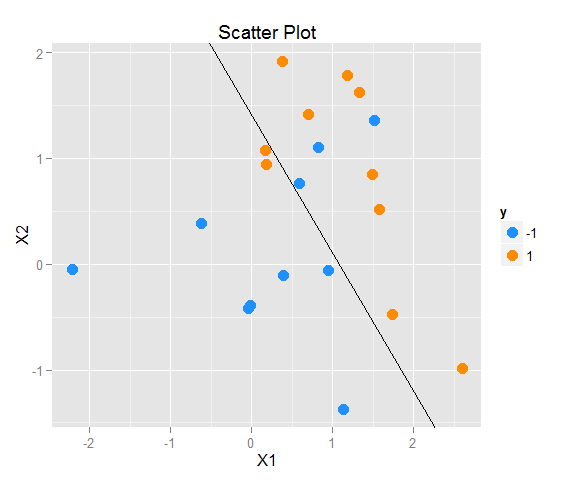
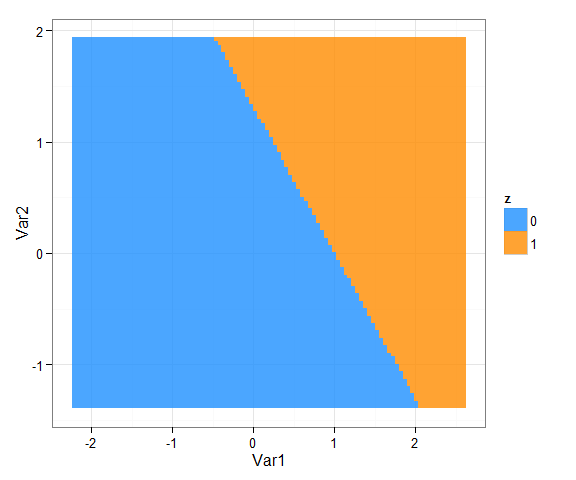
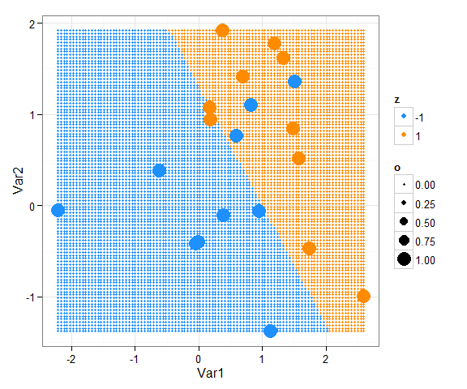

# Support Vector Machine
Jason  
2015年8月30日  


```r
library(ISLR); library(e1071)
library(ggplot2); library(dplyr); library(reshape2)
```
# Support Vector Machine
### Linear Seperable case
The SVM uses the hyperplane to classify data, normally only for two cases. One category is denoted as 1 while the other is -1. When there is truly a hyperplane that seperates two categories, we can use **Maximal Margin Classifier**. Given that we can seperate the data, we want to want a classifier with the max margin $M$.

* $\max_{\beta_{0},\beta_{1},\cdots,\beta_{p}}$ $M$
* Subject to $\sum_{j=1}^{p}\beta^{2}_{j}$
* $y_i(\beta_{0}+\beta_{1}x_{i1}+\cdots+\beta_{p}x_{ip})$ $\geq$ $M$ for $i=1,2,\cdots,n$

We use $sign(\beta_{0}+\beta_{1}x_{i1}+\cdots+\beta_{p}x_{ip})$ to predict. If it is positive, then assign the obersvation to 1, vice versa.

The optimization problem above can be rewrite into the following equation:

* $\min_{\beta_{0},\beta_{1},\cdots,\beta_{p}}$ $||\beta||$
* Subject to $y_i(\beta_{0}+\beta_{1}x_{i1}+\cdots+\beta_{p}x_{ip})$ $\geq$ $1$ for $i=1,2,\cdots,n$

$||\beta||$ is the Euclidean distance of vector $\beta$

Classifiers like this that compute a linear combination of features and output sign are call **perception** in engineering field.

How to solve the problem?

#### 1. Rosenblatt’s Perceptron Learning Algorithm (Take the case that Hyperplane is a line)
We try to find a hyperplane that minimize the distance of misclassified points. The goal is to minimize
$$D(\beta_{0},\beta_{1})=-\sum_{i \in M}y_i(\beta_{0}+\beta_{1}x_{i1})$$

$M$ is the set of misclassification observations.

$D(\beta_{0},\beta_{1})$ is nonnegative and proportional to the distance of the misclassified observations. If M is fixed, the gradient is given by

* $\dfrac{\partial D(\beta_{0},\beta_{1})}{\partial \beta_{1}}$ = -$\sum_{i \in M}y_{i}x_{i}$ 
* $\dfrac{\partial D(\beta_{0},\beta_{1})}{\partial \beta_{0}}$ = -$\sum_{i \in M}y_{i}$

Then we can udpate our parameter $\beta_{0}$ and $\beta_{1}$ by

$$\dbinom{\beta_{0}}{\beta{1}}\rightarrow\dbinom{\beta_{0}}{\beta{1}}+\alpha\dbinom{y_ix_i}{y_i}$$

$alpha$ is the learning rate. It can be proved that if the data are really separable, the algorithm converges to a separating hyperplane in a finite number of
steps. However, it may have several problem.

* When the data are separable, there are many solutions, and which one is found depends on the starting values.
* The “finite” number of steps can be very large. The smaller the gap, the longer the time to find it.
* When the data are not separable, the algorithm will not converge, and cycles develop. The cycles can be long and therefore hard to detect.

#### 2. Optimal Seperating Hyperplanes

The Lagrange function to be minimized with respect to $\beta_{0}$ and $\beta$ is 

$$L_{p}=\dfrac{1}{2}||\beta||^{2}-\sum_{i=1}^{N}\alpha_{i}[y_{i}(x_{i}^{T}\beta+\beta_{0})-1]$$

Take the partial derivative by $\beta$ and $\beta_{0}$

* $\beta=\sum_{i=1}^{N}\alpha_iy_ix_i$
* $0=\sum_{i=1}^{N}\alpha_iy_i$

Substitute them into the previous equation

$$L_{D}=\sum_{i=1}^{N}\alpha_i-\dfrac{1}{2}\sum_{i=1}^{N}\sum_{k=1}^{N}\alpha_{i}\alpha_{k}y_{i}y_{k}x_{i}^{T}x_{k}$$
subject to $\alpha_{i}\geq0$ and $\sum_{i=1}^{N}\alpha_iy_i=0$

Also, $\alpha_{i}[y_{i}(x_{i}^{T}\beta+\beta_{0})-1]=0$

* If $\alpha_{i}>0$, then $y_{i}(x_{i}^{T}\beta+\beta_{0})=1$. It means that $x_i$ is on the boundary of slab.
* If $y_{i}(x_{i}^{T}\beta+\beta_{0})>1$, then $\alpha_{i}=0$. It means that $x_i$ is not on the boundary of slab.

### Not linearly seperate

For nonlinear case, we have two ways to deal with it. First, we can set a tolerance and accept several misclassified observation. This is **Support Vector Classifier**. Another is that we can enlarge the feature space and try to find a separable hyperplane in the higher dimension. For the computing efficiency, we will use kernel to help us enlarge the feature space. The method is **Support Vector Machine** with kernel.

#### 1. Support Vector Classifier
The optimization problem is described below. We will introduce a slack variable $\epsilon_i$ which to control the whether the observation can be trespass the boundary. When $\epsilon_i$ is bigger than 1, the observation is on the wrong side. If $\epsilon_i$ is between 0 and 1, then the observation is between the margin and boundary. If $\epsilon_i$ is 0, then the obersvation is on the right side. $C$ is the tolerance budget.

* $\max_{\beta_{0},\beta_{1},\cdots,\beta_{p}}$ $M$
* Subject to $\sum_{j=1}^{p}\beta^{2}_{j}$
* $y_i(\beta_{0}+\beta_{1}x_{i1}+\cdots+\beta_{p}x_{ip})$ $\geq$ $M(1-\epsilon_i)$ for $i=1,2,\cdots,n$
* $\epsilon_i\geq$, $\sum_{i=1}^{n}\epsilon_i=C$

Like **Maximal Margin Classifier**, we can reformulate it into:

* $\min_{\beta_{0},\beta_{1},\cdots,\beta_{p}}$ $||\beta||$
* Subject to $y_i(\beta_{0}+\beta_{1}x_{i1}+\cdots+\beta_{p}x_{ip})$ $\geq$ $1-\epsilon_i$ for $i=1,2,\cdots,n$
* $\epsilon_i$ $\geq$ $0$, $\sum_{i=1}^{n}\epsilon_i$ $\leq$ $C$

For computational convenience, we will re-express the formula into

* $\min_{\beta_{0},\beta_{1},\cdots,\beta_{p}}$ $\dfrac{1}{2}||\beta||$ + $C\sum_{i=1}^{n}\epsilon_i$
* Subject to $\epsilon_i$ $\geq$ $0$, $y_i(\beta_{0}+\beta_{1}x_{i1}+\cdots+\beta_{p}x_{ip})$ $\geq$ $1-\epsilon_i$ $\forall i$

The Lagrange function:

$$L_{p}=\dfrac{1}{2}||\beta||^{2}+C\sum_{i=1}^{n}\epsilon_i-\sum_{i=1}^{N}\alpha_{i}[y_{i}(x_{i}^{T}\beta+\beta_{0})-(1-\epsilon_i)]-\sum_{i=1}^{n}\mu_i\epsilon_i$$

Take the partial derivative by $\beta$ and $\beta_{0}$

* $\beta=\sum_{i=1}^{N}\alpha_iy_ix_i$
* $0=\sum_{i=1}^{N}\alpha_iy_i$
* $\alpha_i=C-\mu_i$

$$L_{D}=\sum_{i=1}^{N}\alpha_i-\dfrac{1}{2}\sum_{i=1}^{N}\sum_{k=1}^{N}\alpha_{i}\alpha_{k}y_{i}y_{k}x_{i}^{T}x_{k}$$

$$\hat \beta = \sum_{i=1}^{n}\alpha_iy_ix_i$$

```r
set.seed(1)
x <- matrix(rnorm(20*2), ncol=2)
y <- rep(c(1, -1), each=10)
x[y == 1, ] <- x[y == 1, ] + 1
```


```r
data <- data.frame(x=x, y=as.factor(y))
g1 <- ggplot(data) + geom_point(aes(x=x.1, y=x.2, color=y), shape=16, size=4) + ggtitle("Scatter Plot") + xlab("X1") + ylab("X2") + scale_color_manual(values=c("dodgerblue", "darkorange"))
g1
```


```r
svm.fit <- svm(y ~ ., data=data, kernel="linear", cost=10, scale=FALSE)
```


```r
#Get the coefficient
coefs <- t(svm.fit$coefs) %*% svm.fit$SV
b <- -coefs[1]/coefs[2]
#Intercept
a <- svm.fit$rho
```


```r
g1 + geom_abline(intercept=a, slope=b)
```



```r
x_max <- apply(x, 2, max)
x_min <- apply(x, 2, min)
x1var <- seq(x_max[1], x_min[1], length.out=100)
x2var <- seq(x_max[2], x_min[2], length.out=100)
mydata <- expand.grid(x1var, x2var)
mydata$z <- as.factor(((mydata[, 1]*coefs[1] + mydata[, 2]*coefs[2] + b) > 0)*1)
ggplot(mydata) + geom_tile(aes(x=Var1, y=Var2, z=z, fill=z), alpha=0.8) + theme_bw() + scale_fill_manual(values=c("dodgerblue", "darkorange"))
```




```r
mydata <- expand.grid(x1var, x2var)
mydata2 <- as.data.frame(rbind(as.matrix(mydata), x))

mydata2$z <- as.factor(c(((mydata[, 1]*coefs[1] + mydata[, 2]*coefs[2] + b) > 0)*2 - 1, y))
mydata2$o <- rep(c(0, 1), c(10000, 20))
ggplot(mydata2) + geom_point(aes(x=Var1, y=Var2, color=z, size=o), shape=19) + theme_bw() + scale_color_manual(values=c("dodgerblue", "darkorange"))
```




```r
plot(svm.fit, data)
```


```r
#We can use index to find out those observation in support vector
svm.fit$index
```

```
 [1]  1  3  4  6  8 10 11 12 18 19 20
```


```r
#Cross-validation by tune
svm.cv <- tune(svm, y ~ ., data=data, kernel="linear", range=list(cost=c(0.001, 0.01, 0.1, 1, 10, 100, 1000)))
summary(svm.cv)
```

```

Parameter tuning of 'svm':

- sampling method: 10-fold cross validation 

- best parameters:
 cost
    1

- best performance: 0.25 

- Detailed performance results:
   cost error dispersion
1 1e-03  0.45  0.4972145
2 1e-02  0.45  0.4972145
3 1e-01  0.35  0.4743416
4 1e+00  0.25  0.3535534
5 1e+01  0.35  0.4116363
6 1e+02  0.30  0.4216370
7 1e+03  0.30  0.4216370
```


```r
final.model <- svm.cv$best.model
summary(final.model)
```

```

Call:
best.tune(method = svm, train.x = y ~ ., data = data, ranges = list(cost = c(0.001, 
    0.01, 0.1, 1, 10, 100, 1000)), kernel = "linear")


Parameters:
   SVM-Type:  C-classification 
 SVM-Kernel:  linear 
       cost:  1 
      gamma:  0.5 

Number of Support Vectors:  13

 ( 7 6 )


Number of Classes:  2 

Levels: 
 -1 1
```


```r
plot(final.model, data)
```


```r
x.test <- matrix(rnorm(20*2), ncol=2)
y.test <- rep(c(1, -1), each=10)
x.test[y.test == 1, ] <- x.test[y.test == 1, ] + 1
testdata <- data.frame(x=x.test, y=as.factor(y.test))
#Prediction
y.predict <- predict(final.model, testdata)
table(Predict=y.predict, True=y.test)
```

```
       True
Predict -1 1
     -1  6 3
     1   4 7
```
#### 2. Support Vector Machine

```r
#Non-linear data
set.seed(1)
x <- matrix(rnorm(200*2), ncol=2)
x[1:100, ] <- x[1:100, ] + 2
x[101:150, ] <- x[101:150, ] - 2
y <- c(rep(1, 150), rep(2, 50))
data <- data.frame(x=x, y=as.factor(y))
```


```r
g2 <- ggplot(data) + geom_point(aes(x=x.1, y=x.2, color=y), shape=16, size=4) + ggtitle("Scatter Plot") + xlab("X1") + ylab("X2") + scale_color_manual(values=c("dodgerblue", "darkorange"))
g2
```


```r
train <- sample(200, 100)
svmfit <- svm(y ~ ., data=data[train, ], kernel="radial", gamma=1, cost=1)
plot(svmfit, data[train, ])
```


### Reference

* The Elements of Statistical Learning, 
