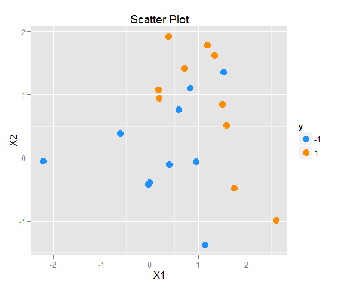
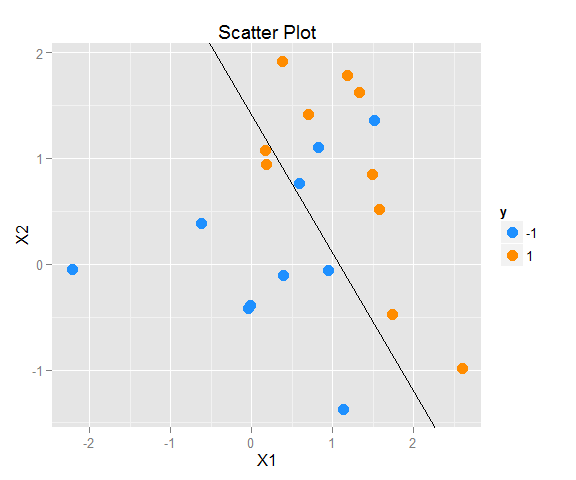
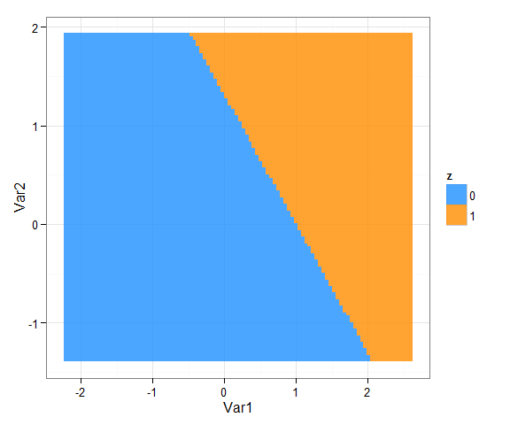
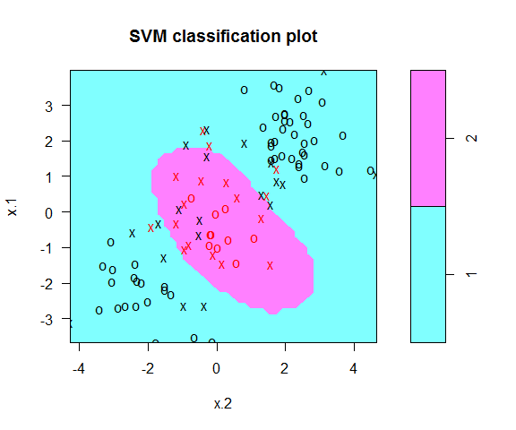
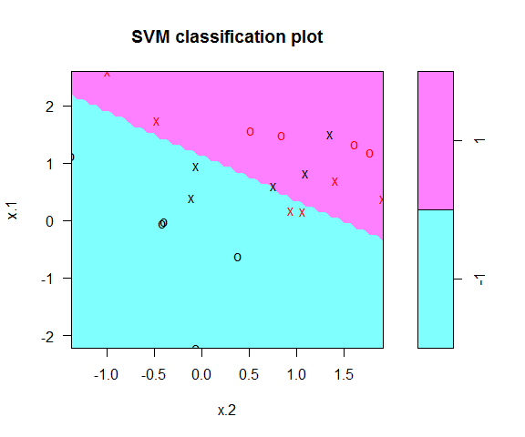
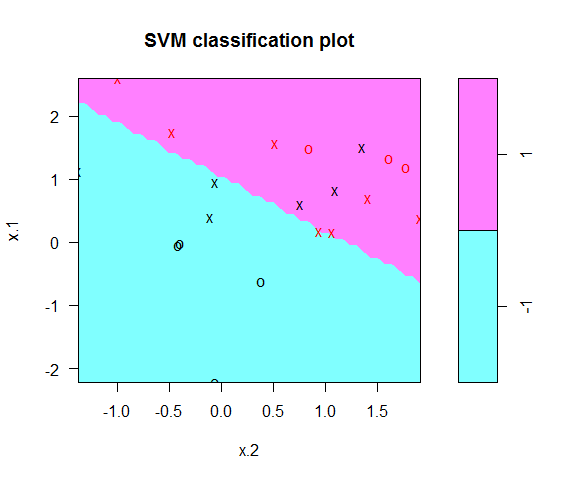
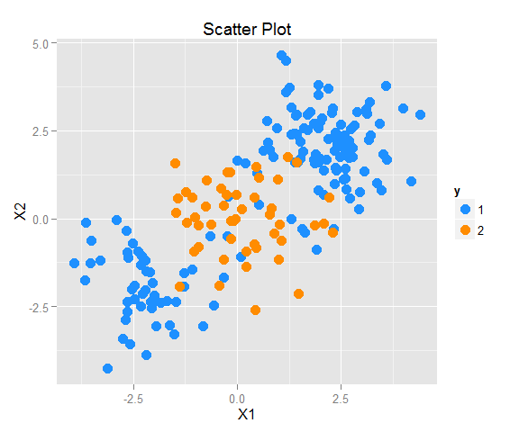
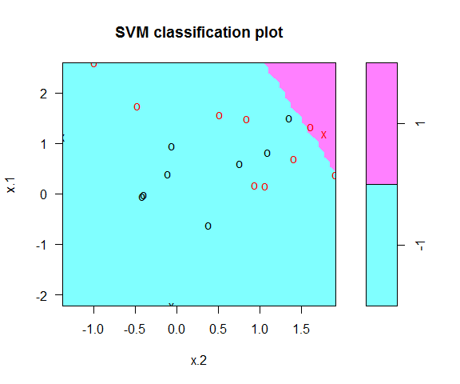

# Support Vector Machine
Jason  
2015年8月30日  


```r
library(ISLR); library(e1071)
library(ggplot2); library(dplyr); library(reshape2)
```

```

Attaching package: 'dplyr'

The following objects are masked from 'package:stats':

    filter, lag

The following objects are masked from 'package:base':

    intersect, setdiff, setequal, union
```
# Not linearly seperate

```r
set.seed(1)
x <- matrix(rnorm(20*2), ncol=2)
y <- rep(c(1, -1), each=10)
x[y == 1, ] <- x[y == 1, ] + 1
```


```r
data <- data.frame(x=x, y=as.factor(y))
g1 <- ggplot(data) + geom_point(aes(x=x.1, y=x.2, color=y), shape=16, size=4) + ggtitle("Scatter Plot") + xlab("X1") + ylab("X2") + scale_color_manual(values=c("dodgerblue", "darkorange"))
g1
```




```r
svm.fit <- svm(y ~ ., data=data, kernel="linear", cost=10, scale=FALSE)
```


```r
#Get the coefficient
coefs <- t(svm.fit$coefs) %*% svm.fit$SV
b <- -coefs[1]/coefs[2]
#Intercept
a <- svm.fit$rho
```


```r
g1 + geom_abline(intercept=a, slope=b)
```



```r
x_max <- apply(x, 2, max)
x_min <- apply(x, 2, min)
x1var <- seq(x_max[1], x_min[1], length.out=100)
x2var <- seq(x_max[2], x_min[2], length.out=100)
mydata <- expand.grid(x1var, x2var)
mydata$z <- as.factor(((mydata[, 1]*coefs[1] + mydata[, 2]*coefs[2] + b) > 0)*1)
ggplot(mydata) + geom_tile(aes(x=Var1, y=Var2, z=z, fill=z), alpha=0.8) + theme_bw() + scale_fill_manual(values=c("dodgerblue", "darkorange"))
```




```r
mydata <- expand.grid(x1var, x2var)
mydata2 <- as.data.frame(rbind(as.matrix(mydata), x))

mydata2$z <- as.factor(c(((mydata[, 1]*coefs[1] + mydata[, 2]*coefs[2] + b) > 0)*2 - 1, y))
mydata2$o <- rep(c(0, 1), c(10000, 20))
ggplot(mydata2) + geom_point(aes(x=Var1, y=Var2, color=z, size=o), shape=19) + theme_bw() + scale_color_manual(values=c("dodgerblue", "darkorange"))
```




```r
plot(svm.fit, data)
```




```r
#We can use index to find out those observation in support vector machine
svm.fit$index
```

```
 [1]  1  3  4  6  8 10 11 12 18 19 20
```


```r
#Cross-validation by tune
svm.cv <- tune(svm, y ~ ., data=data, kernel="linear", range=list(cost=c(0.001, 0.01, 0.1, 1, 10, 100, 1000)))
summary(svm.cv)
```

```

Parameter tuning of 'svm':

- sampling method: 10-fold cross validation 

- best parameters:
 cost
    1

- best performance: 0.25 

- Detailed performance results:
   cost error dispersion
1 1e-03  0.45  0.4972145
2 1e-02  0.45  0.4972145
3 1e-01  0.35  0.4743416
4 1e+00  0.25  0.3535534
5 1e+01  0.35  0.4116363
6 1e+02  0.30  0.4216370
7 1e+03  0.30  0.4216370
```


```r
final.model <- svm.cv$best.model
summary(final.model)
```

```

Call:
best.tune(method = svm, train.x = y ~ ., data = data, ranges = list(cost = c(0.001, 
    0.01, 0.1, 1, 10, 100, 1000)), kernel = "linear")


Parameters:
   SVM-Type:  C-classification 
 SVM-Kernel:  linear 
       cost:  1 
      gamma:  0.5 

Number of Support Vectors:  13

 ( 7 6 )


Number of Classes:  2 

Levels: 
 -1 1
```


```r
plot(final.model, data)
```




```r
x.test <- matrix(rnorm(20*2), ncol=2)
y.test <- rep(c(1, -1), each=10)
x.test[y.test == 1, ] <- x.test[y.test == 1, ] + 1
testdata <- data.frame(x=x.test, y=as.factor(y.test))
#Prediction
y.predict <- predict(final.model, testdata)
table(Predict=y.predict, True=y.test)
```

```
       True
Predict -1 1
     -1  6 3
     1   4 7
```

# Linearly seperate

```r
set.seed(1)
xl <- matrix(rnorm(20*2), ncol=2)
y <- rep(c(-1, 1), each=10)
xl[y == 1] <- x[y == 1] + 3
```


```r
data2 <- data.frame(x=xl, y=as.factor(y))
ggplot(data2) + geom_point(aes(x=x.1, y=x.2, color=y), shape=16, size=4) + ggtitle("Scatter Plot") + xlab("X1") + ylab("X2") + scale_color_manual(values=c("dodgerblue", "darkorange"))
```




```r
svm.fit2 <- svm(y ~ ., data=data2, kernel="linear", cost=1e5)
summary(svm.fit2)
```

```

Call:
svm(formula = y ~ ., data = data2, kernel = "linear", cost = 1e+05)


Parameters:
   SVM-Type:  C-classification 
 SVM-Kernel:  linear 
       cost:  1e+05 
      gamma:  0.5 

Number of Support Vectors:  3

 ( 1 2 )


Number of Classes:  2 

Levels: 
 -1 1
```


```r
plot(svm.fit2, data)
```



